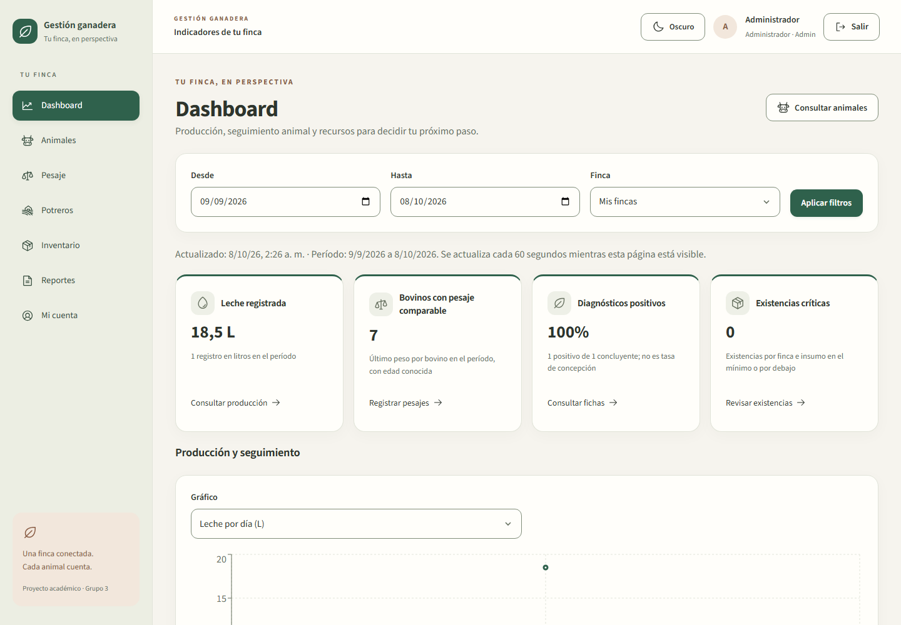
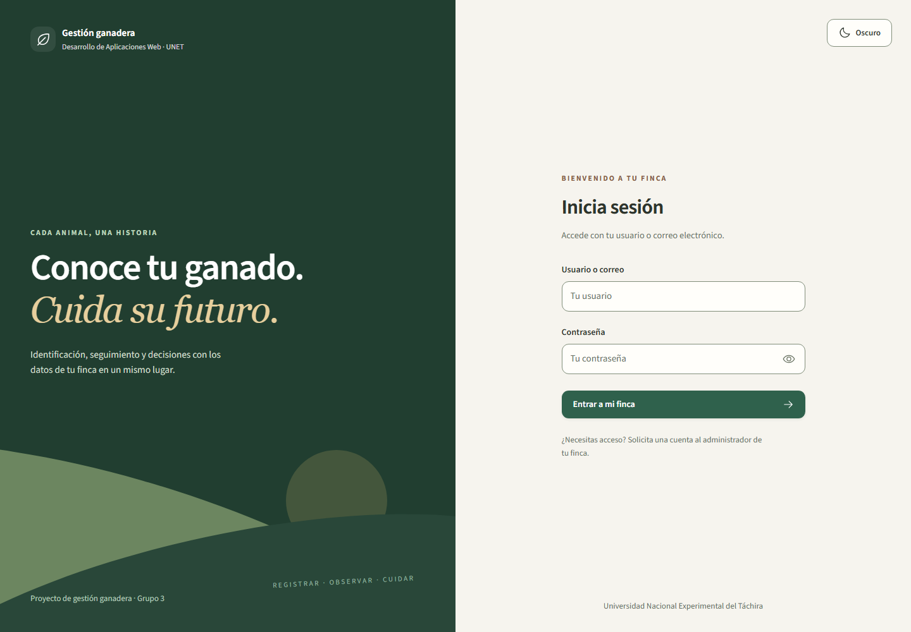

# Sistema de gestión ganadera

API y SPA React para administrar fincas, potreros, lotes, animales, su estado de salud, pesajes, productos obtenidos del ganado y existencias de insumos. Construida con **.NET 10, C# 14, Onion Architecture, EF Core 10 y PostgreSQL 15**, con ASP.NET Core Identity, JWT, permisos por operación y validación FluentValidation.

Un animal puede producir leche, lana, carne u otros productos a lo largo de su vida. Estos resultados se registran en **una única tabla `AnimalProduction`**, indicando el animal, la finca, la fecha, el método, la cantidad y la unidad. `OperationId` permite registrar varios productos de una misma operación; por ejemplo, carne y piel del mismo sacrificio.

Los productos obtenidos se distinguen de los **insumos comprados**: alimentos, medicamentos y vacunas se catalogan en `Products`, y sus existencias, umbrales y ubicación se guardan **por finca** en `FarmInventory`.

## Uso y galería de la SPA

La raíz del sitio y el login directo llevan al administrador con permisos al dashboard; Employee entra a Animales. Los enlaces privados conservan la pantalla/pestaña solicitada. La [guía de uso](docs/product-and-technical-guide.md) explica el recorrido y los contratos; el [contraste con el ejemplo del profesor](docs/fase4-referencia-profesor.md) justifica la adaptación al dominio ganadero.

El dashboard prioriza leche registrada, bovinos con pesaje comparable, diagnósticos positivos/concluyentes y existencias críticas. Cada tarjeta declara su alcance y permite continuar una operación. El filtro de finca/período se conserva al abrir el reporte de producción; inventario y valoración muestran el saldo actual.



El acceso incluye mostrar/ocultar contraseña, validación por campo y avisos que explican qué hacer. La fuente Source Sans 3 se sirve localmente; tema y colores comparten tokens semánticos.



[Dashboard en tema oscuro](docs/screenshots/dashboard-dark.png) y [recorrido de dashboard móvil](docs/screenshots/dashboard-mobile.png): mismas operaciones y datos, con tarjetas en columna y navegación adaptada. Son capturas del entorno de demostración, no cifras de una finca real.

## Iniciar con Docker Desktop

Ejecutar desde la raíz del repositorio en Git Bash. Docker Desktop debe estar iniciado; `docker version` debe mostrar cliente y servidor.

```bash
cp .env.example .env
```

Completar `.env`: `POSTGRES_PASSWORD`, `JWT_KEY`, `SEED_ADMIN_PASSWORD` y, para probar Employee, `SEED_EMPLOYEE_PASSWORD`. Las contraseñas requieren al menos ocho caracteres, mayúscula, minúscula, número y símbolo. Generar un secreto JWT con `openssl rand -base64 48`. **No volver a copiar `.env.example` si ya existe un `.env` configurado.**

```bash
docker compose up --build -d --wait
```

El comando `--seed` aplica las migraciones y carga datos de demostración de forma idempotente. La SPA estará en `http://localhost:18080`, la API en `/api` y Swagger en `http://localhost:18080/swagger`. Usuario Admin: valor de `SEED_ADMIN_USERNAME`; contraseña: valor configurado en `.env`. Employee se crea solamente si tiene contraseña configurada.

**Persistencia existente:** PostgreSQL 15 usa el volumen nuevo `daw-postgres15-data`. Un volumen creado con PostgreSQL 17 no se puede conectar directamente a PostgreSQL 15: se conserva y requiere exportación/importación para trasladar sus datos. La migración de producción convierte leche, lana y carne con cantidades válidas; bloquea registros de huevos por lote sin animal y datos inconsistentes. Los insumos antiguos sin precios se conservan inactivos para revisión. No ejecuta un borrado general de la base. El detalle está en [instalación y actualización](docs/setup.md).

## API y CRUD

Para los recursos de la tabla existen **POST, GET de lista, GET por ID, PUT por ID y DELETE por ID**.

| Ruta base | Recurso |
| --- | --- |
| `/api/farms` | Fincas |
| `/api/paddocks` | Potreros |
| `/api/lots` | Lotes; `/api/herds` es un alias persistente |
| `/api/species` | Especies |
| `/api/breeds` | Razas |
| `/api/animals` | Animales |
| `/api/categories` | Categorías de insumos |
| `/api/products` | Catálogo de insumos con SKU, marca y precios |
| `/api/inventory` | Existencias y umbrales por finca |
| `/api/weights` | Pesajes |
| `/api/production` | Productos obtenidos de un animal |

`POST /api/animals` está disponible nuevamente. `PATCH /api/animals/{id}/health-status` conserva la ruta anterior y recibe `{"status":"InTreatment","reason":"Revisión veterinaria"}`. También existe `/health` con `healthStatus`. Ambos registran el historial del cambio.

Otras operaciones: login, registro, renovación de token, perfil actual; administración de permisos; subida, consulta privada y eliminación de fotos; animales sin actualización reciente. Los contratos completos y ejemplos están en Swagger y la [guía del producto](docs/product-and-technical-guide.md).

**Reglas de eliminación:** todos los DELETE requieren Admin/Administrador. Las referencias importantes usan `Restrict`; si existen dependencias se devuelve 409 y deben resolverse primero. El sacrificio es irreversible: su rendimiento puede corregirse, pero el registro no se borra ni el animal se reactiva. El historial sanitario también se conserva.

## Verificación

```bash
MSYS_NO_PATHCONV=1 docker run --rm -v "$(pwd -W):/src" -w /src \
  mcr.microsoft.com/dotnet/sdk:10.0 dotnet test DAW.slnx -c Release
```

Importar [colección Postman](postman/Cattle-Management.full.postman_collection.json) y [entorno](postman/Daw.postman_environment.json). Completar las contraseñas del entorno sin exportarlas al repositorio y ejecutar la colección en orden. Para ejecución automatizada consultar [pruebas reproducibles](docs/setup.md). [db/verification.sql](db/verification.sql) comprueba tablas, índices, restricciones y datos sembrados.

### Relación entre reglas y pruebas

| SUT / flujo | Pruebas | Comportamiento comprobado |
| --- | --- | --- |
| CrudService<Product, ProductRequest> + ProductDefinition | [ProductCatalogServiceTests](tests/UnitTests/ProductCatalogServiceTests.cs) | Precios decimales, SKU normalizado, categoría inexistente/inactiva, conflictos y ausencia de escritura; Moq estricto |
| AnalyticsService | [AnalyticsServiceTests](tests/UnitTests/AnalyticsServiceTests.cs) | Valoración y umbrales, rotación trazable, exclusión de unidades incompatibles, identidad finca/lote, último peso y denominador reproductivo |
| Cuidados y crecimiento animal | [AnimalCareServiceTests](tests/UnitTests/AnimalCareServiceTests.cs), [WithdrawalPolicyTests](tests/UnitTests/WithdrawalPolicyTests.cs), [AnimalGrowthServiceTests](tests/UnitTests/AnimalGrowthServiceTests.cs) | Integridad de eventos, retiro farmacológico y orden/fórmula de GDP |
| Sesión y autorización HTTP | [BrowserSessionIntegrationTests](tests/Core.Tests/BrowserSessionIntegrationTests.cs), [FarmAccessSecurityTests](tests/Core.Tests/FarmAccessSecurityTests.cs) | Cookies, protección de sesión y aislamiento de fincas en el pipeline de prueba |
| Portada y seguimiento en la SPA | [home.spec.ts](src/frontend/e2e/home.spec.ts), [analytics.spec.ts](src/frontend/e2e/analytics.spec.ts) | Inicio por rol, recuperación de sesión/destino, KPI contrastados con API/PostgreSQL y filtros conservados hasta el reporte |

Las pruebas aisladas siguen Arrange–Act–Assert y verifican interacciones del repositorio sin EF/PostgreSQL. Core.Tests usa EF InMemory/pipeline HTTP; Playwright dirigido usa API/PostgreSQL del entorno de prueba. Los [reportes .NET y cobertura medida](docs/evidence/phase4-audit/README.md) y la [verificación de portada](docs/evidence/phase4-home/README.md) distinguen cada evidencia. Casos aprobados y cobertura de líneas son métricas diferentes.

## Arquitectura y documentación

| Capa | Responsabilidad |
| --- | --- |
| `Core.Domain` | Entidades ganaderas y tipos del negocio, sin EF ni HTTP |
| `Core.Application` | Casos de uso CRUD, reglas de coherencia, DTO, validadores y puertos |
| `Infrastructure` | EF Core, PostgreSQL, migraciones, repositorios, Identity, JWT y archivos |
| `Presentation.API` | HTTP, autorización, composición DI y Problem Details |
| `Core.Tests` | Pruebas del dominio, aplicación, persistencia aislada, seguridad y pipeline HTTP |
| `UnitTests` | Casos de uso de Core.Application aislados con xUnit y Moq, sin EF ni base física |
| `src/frontend` | SPA React 18, Vite, TypeScript, Tailwind, AuthContext y ThemeContext |

- [Instalación, migración, ejecución y pruebas](docs/setup.md).
- [Producto, contratos y fundamentos técnicos](docs/product-and-technical-guide.md).
- [Producción unificada y CRUD: reglas y decisiones](docs/modelo-produccion-y-crud.md).
- [Verificación de Fase 2 y Fase 3](docs/fases-2-y-3.md).
- [Evidencias ejecutadas y reproducción de pruebas](docs/evidencias-verificacion.md).
- [Diagrama entidad–relación: imágenes y visor interactivo](db/diagram/README.md).
- [Sesión persistente: decisión, controles, defensa y pruebas](docs/fase4-sesion.md).
- [Ficha, fotografías, GDP y pesaje consecutivo](docs/fase4-animales.md).
- [Sanidad, reproducción, retiro y producción del animal](docs/fase4-sanidad.md).
- [Potreros, capacidad, lotes presentes y traslados](docs/fase4-potreros.md).
- [Interfaz, paleta semántica y navegación de la finca](docs/fase4-ui.md).
- [Referencia del profesor y adaptación de dashboard/documentación](docs/fase4-referencia-profesor.md).
- [Estado y trabajo restante de Fase 4](docs/fase4-estado.md).
- [Verificación ejecutada de Fase 4](docs/fase4-verificacion.md).
- [Decisiones técnicas](docs/engineering-decisions.md).
- [Visión del negocio completo](docs/guia-de-negocio.md).

La SPA permite recuperar la sesión al recargar, consultar y editar animales, cargar fotografías comprimidas y privadas, revisar la curva Recharts de peso/GDP y registrar pesajes consecutivos. La ficha conecta sanidad, reproducción, retiro farmacológico, producción paginada y un árbol genealógico navegable. El retiro se valida en el servidor para leche y sacrificio. El mapa de potreros muestra ocupación, lotes presentes, densidad y permanencia registrada; el servidor limita la capacidad y guarda los traslados. Inventario, dashboard y exportaciones XLSX/PDF ya están conectados a la API. El dashboard incluye leche diaria por lote actual; la ficha avisa automáticamente ante pérdida de peso. La [auditoría de entrega](docs/fase4-auditoria.md) distingue los requisitos cubiertos, las diferencias deliberadas y los pendientes; los [reportes seleccionados](docs/evidence/phase4-audit/README.md) contienen evidencia real de pruebas y cobertura.

## Cierre técnico para la evaluación del 9 de octubre

La [guía de evaluación vigente](docs/fase4-evaluacion-09-octubre.md) relaciona los cuatro criterios de 10 puntos con el código, la demostración y las pruebas. [Estado actual](docs/fase4-estado.md) y [evidencia seleccionada](docs/evidence/phase4-final/README.md).

Usuarios permite crear/editar cuentas, asignar roles/fincas/permisos adicionales, desactivar y restablecer contraseñas con revocación inmediata de sesiones. Seguimiento guarda objetivos de GDP por finca o animal y presenta avisos calculados. Potreros incluye un plano esquemático configurable con señales de capacidad y permanencia. Las [decisiones de usuarios](docs/fase4-usuarios.md), [crecimiento](docs/fase4-animales.md) y [potreros](docs/fase4-potreros.md) explican sus límites.

La colección [Fase 4](postman/Phase4.postman_collection.json) verifica cuentas, revocación, objetivos, plano y sesión del navegador con cookie/CSRF. Usar el entorno de demostración, configurar secretos localmente y no exportarlos al repositorio.
