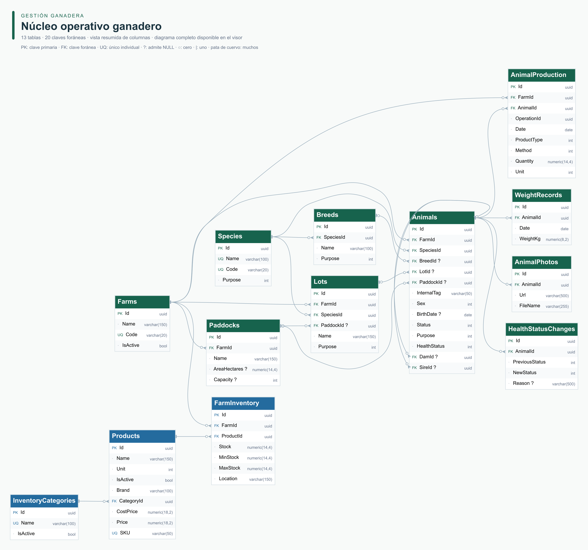

# Diagrama entidad–relación

Modelo físico generado a partir de [schema.sql](../schema.sql): **43 tablas**, de las cuales 42 pertenecen al modelo de la aplicación y una es `__EFMigrationsHistory`, con **72 claves foráneas**. El SQL corresponde al modelo final de las cuatro migraciones actuales.

## Consultar el diagrama

- [Visor interactivo](index.html): abrir el archivo en un navegador o entrar a `/erd/` en la aplicación Docker. Funciona sin conexión, permite buscar tablas, acercar, desplazarse y consultar columnas, claves, nulabilidad, índices y comportamiento de borrado.
- [DER completo en PNG](der-completo.png): todas las tablas y sus columnas; adecuado para descargar o compartir.
- [DER completo en SVG](der-completo.svg): ampliar sin perder definición; recomendado para inspeccionar los detalles del esquema completo.
- [Imagen del núcleo operativo](der-nucleo.png): trece tablas y veinte relaciones físicas, con columnas resumidas de animales, producción e inventario.



El visor inicia en la vista resumida y permite cambiar a **Esquema completo**. Seleccionar una tabla resalta sus relaciones inmediatas. La lista de columnas del panel siempre utiliza la definición completa del SQL, aunque la imagen del núcleo muestre una selección.

## Convenciones y alcance

| Marca | Significado |
| --- | --- |
| `PK` | Columna de clave primaria; las columnas de una clave compuesta se interpretan conjuntamente |
| `FK` | Columna con clave foránea declarada en PostgreSQL |
| `UQ` | Índice único individual; los índices compuestos se consultan en el panel de detalle |
| `?` | Columna que admite `NULL` |
| Círculo | Cardinalidad mínima cero |
| Barra | Uno |
| Pata de cuervo | Muchos |

Cada línea sale de la tabla padre y llega a la columna de referencia de la hija. En este esquema las relaciones físicas son 1:N: un padre admite cero o muchos hijos; una FK obligatoria exige un padre por hijo y una FK nullable permite cero o uno. Las tablas puente materializan relaciones N:M, por ejemplo usuarios–roles y fincas–productos.

Las relaciones se obtienen exclusivamente de las restricciones del SQL. Algunos campos `FarmId` y referencias de usuario son escalares sin FK; por eso no generan líneas. `OperationId` agrupa rendimientos de una operación y no referencia una tabla `Operations`. `OwnerId`, `EntityId` y otras referencias dinámicas tampoco se representan como claves foráneas.

`Products` contiene **insumos comprados**; `AnimalProduction`, **rendimientos obtenidos de un animal**. Leche, lana, carne y otros productos comparten esta última tabla. `HealthEvents` y `ReproductiveEvents` usan una tabla por jerarquía (TPH), con discriminador y columnas físicas de sus subtipos.

Los colores agrupan tablas por área funcional. La presencia de una tabla en el DER no acredita que su proceso completo esté implementado: la API actual ofrece el núcleo CRUD y seguridad descritos en [README](../../README.md); los procesos complementarios conservan el alcance indicado en la documentación técnica.

## Fuente y regeneración

[schema-model.json](schema-model.json) contiene el catálogo extraído y el SHA-256 del SQL de origen. [der-completo.dot](der-completo.dot) conserva la representación Graphviz. No contienen filas de usuarios, contraseñas, tokens ni datos de negocio.

Desde la raíz, con Node.js 20 o posterior:

```bash
npm ci --prefix scripts/erd
npm run generate --prefix scripts/erd
```

El script está en [generate.cjs](../../scripts/erd/generate.cjs), con dependencias fijadas y lockfile. Valida que se hayan leído todas las tablas y claves foráneas y que sus columnas existan. La disposición utiliza [Viz.js/Graphviz](https://viz-js.com/api/) y la exportación PNG utiliza [Sharp](https://sharp.pixelplumbing.com/api-constructor/).

Después de una migración, exportar primero el esquema actualizado de PostgreSQL y regenerar las imágenes y el visor antes de publicarlos. No editar los archivos generados para simular un esquema distinto del SQL.
