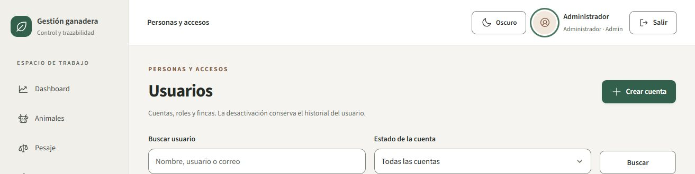

# Ajuste de acceso a Mi cuenta y aclaraciones

8 de octubre de 2026, revisión posterior a la auditoría integral.

Mi cuenta se abre mediante el avatar del encabezado; se retiró del menú lateral y de Más. Las iniciales permanecen visibles en reposo. El icono de perfil aparece con hover o foco visible de teclado. El enlace tiene nombre accesible, ayuda nativa y área de 44 × 44 px; conserva los guards y la protección de borradores de React Router. No se añadió una fotografía ficticia ni un icono permanente.

Build TypeScript/Vite y Docker aprobados. Revisión dirigida de quality.spec.ts: **7 aprobadas, una omisión exclusiva móvil en escritorio**; incluye 44 comprobaciones axe, hover/foco/Enter del avatar, navegación móvil y exportación segura. Al revisar estados transitorios se corrigió role=status en los skeletons de dashboard, inventario y usuarios. [Log](account-access-followup.log.gz).

Se comprobó además la base de demostración mediante una consulta agregada de solo lectura: 5.850 AuditLogs, 3.308 con valores previos, 3.695 con valores nuevos, 5.850 con autor y ninguno con IP. No se publicaron los JSON ni identidades de esos eventos. La existencia de un campo IpAddress no implica que se complete. La auditoría actual cubre escrituras por ManagementRepository y eventos administrativos de usuario, no login/logout o escrituras SQL externas; no tiene visor/endpoint de consulta en la SPA.

La [aclaración de cumplimiento](../../fase4-auditoria-integral.md) distingue cobertura de código, requisitos implementados y acciones de entrega. El instrumento del 9 de octubre pide cobertura razonable; no establece 100% de líneas. No se calcula ni predice una nota. El registro de tasa BCV comprobable, ensayo y entrega siguen siendo acciones identificadas del equipo.

