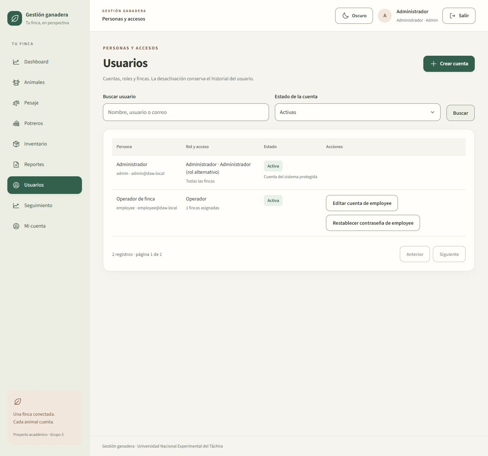

# Preparación de la evaluación del 9 de octubre de 2026

## Fuente vigente

Se leyó completo el documento del profesor **Instrucciones y Evaluación 09 Octubre .docx**, incluyendo su tabla de evaluación. Ubicación local: Documentos/Universidad/Desarrollo de Aplicaciones Web/Fase 4. No se copia el archivo del profesor al repositorio.

Este instrumento declara **40 puntos: cuatro criterios de 10**, cada uno dividido en dos aspectos de 5. Se conserva la rúbrica anterior de 80 puntos como referencia histórica; para esta presentación se usa el instrumento nuevo. La página [REAF-F4](https://gramirezsunet.github.io/desarrolloAplicacionesWeb/REAF-F4/) complementa las recomendaciones generales y las del Grupo 3. El [ejemplo del profesor](https://github.com/gramirezsunet/desarrolloAplicacionesWeb) orienta la organización de la documentación; las métricas y reglas se adaptan al ganado.

## Correspondencia de criterios

| Criterio | Evidencia implementada | Demostración |
| --- | --- | --- |
| SPA y componentización: React/Vite/rutas/Tailwind (5) + modularidad/reuso/estado (5) | React 18, Vite, React Router, Tailwind integrado, componentes compartidos, páginas por operación, hooks/API y contextos separados | Navegar sin recargar; abrir URL directa de una pestaña; mostrar escritorio/móvil y componentes Field, Controls, SidePanel, SearchPicker y GrowthAlerts |
| API y estado: HTTP/errores (5) + JWT/seguridad/estado (5) | Cliente central con Bearer, AbortController, RFC 7807, AuthContext, JWT en memoria, cookie refresh HttpOnly/CSRF, guards y permisos en servidor | Login, recarga, logout, credenciales inválidas, 403 Employee, 401 tras desactivar cuenta y 409 de edición obsoleta |
| Dashboard: tarjetas KPI (5) + gráficos/filtros/integración (5) | Cuatro tarjetas ganaderas, gráficos con tooltip/selector, filtro finca/fechas, datos PostgreSQL/API y polling de 60 s visible | Cambiar período; contrastar respuesta de analytics con las tarjetas; abrir reporte conservando filtros |
| xUnit/Moq: lógica (5) + aislamiento/cobertura (5) | 153 pruebas UnitTests, 144 Core.Tests; UnitTests referencia solo Application, con Moq estricto; cobertura instrumentada separada | Ejecutar suite; mostrar éxito y rechazo esperado de reglas, Verify(Times.Once/Never), TRX y Cobertura |

El documento exige **al menos tres tarjetas** alimentadas desde backend. Hay cuatro: leche en litros registrada en el período, bovinos con último peso comparable y edad conocida, diagnósticos positivos/concluyentes y existencias críticas actuales.

La proporción de diagnósticos no representa tasa de concepción. Sin datos concluyentes no se inventan porcentajes. Se excluyen unidades de leche incompatibles y pesajes sin nacimiento válido. La valoración usa costo/precio reales por insumo; la rotación solo se calcula con saldo inicial trazable. Los alcances están en referencia-profesor.md y operaciones.md.

## Recorrido sugerido de defensa

1. **Acceso y estado:** iniciar Admin; recargar, abrir un destino privado y cerrar sesión. Mostrar que localStorage conserva solo tema, sessionStorage no contiene credenciales y la cookie de renovación es HttpOnly. Reingresar y explicar memoria, renovación y CSRF.
2. **Dashboard:** mostrar las cuatro tarjetas, cambiar finca/período y gráfico; abrir producción desde la tarjeta conservando filtros. Declarar cuáles métricas son del período y cuáles son saldos actuales. La actualización es polling cada minuto visible; no se afirma WebSocket ni tiempo real instantáneo.
3. **Animal y pesaje:** buscar un arete, abrir ficha y sus pestañas; registrar peso sin recargar. GDP = diferencia de peso / días entre fechas distintas. El último pesaje del día determina la curva; todos permanecen en el historial.
4. **Seguimiento y potreros:** configurar GDP de finca, guardar objetivo individual y recargar. Mostrar aviso con fechas y pesos. Seleccionar finca en Potreros, configurar su plano si se trata de una instalación existente, abrir residentes en el lateral y explicar relleno por capacidad/borde por permanencia. Si la fecha de entrada falta, el sistema lo declara.
5. **Personas y permisos:** crear cuenta de prueba, asignar finca y rol; demostrar que Employee no administra usuarios. Restablecer/desactivar y verificar que el token previo recibe 401. Conservar la cuenta inactiva al terminar.
6. **Pruebas:** ejecutar UnitTests, abrir dos escenarios representativos y explicar el aislamiento. Mostrar también integración y evidencia PostgreSQL, distinguiendo ambos alcances.

No modificar contraseñas o permisos de cuentas reales para la demostración. Usar usuarios de prueba y datos de la finca DEMO. No exponer .env, tokens o el entorno privado de Newman al proyectar el terminal.

## Pruebas y evidencia reproducibles

Desde la raíz, Git Bash y Docker Desktop iniciado:

~~~bash
# Con .env ya configurado: migra/siembra antes de servir la API.
docker compose up --build -d --wait

# Aislamiento de Application mediante xUnit/Moq.
MSYS_NO_PATHCONV=1 docker run --rm -v "$(pwd -W):/src" -w /src \
  mcr.microsoft.com/dotnet/sdk:10.0 \
  dotnet test tests/UnitTests/UnitTests.csproj -c Release --collect:"XPlat Code Coverage"
~~~

[Reportes de esta revisión](evidence/phase4-final/README.md): TRX, cobertura por suite, resumen HTTP sin credenciales y conteos del navegador. Las pruebas negativas son pruebas aprobadas que esperan un rechazo; no se rompe la aplicación para producir una suite fallida.

Cobertura de Core.Application: **48,29 % de líneas y 50,37 % de ramas en UnitTests aisladas**; **88,32 % de líneas y 58,28 % de ramas en Core.Tests**. Son ejecuciones distintas; no se suman porcentajes ni se llama a la integración cobertura aislada. Siguen existiendo rutas de Application cubiertas por integración que conviene reforzar con Moq. El instrumento no fija un porcentaje mínimo numérico; estos valores deben presentarse con su alcance.

El arranque se comprobó con un volumen PostgreSQL vacío en un proyecto Compose separado: seis migraciones, seed, login 200 y dos potreros de ejemplo en el plano. La instancia de demostración existente conserva sus datos y posiciones; no se aplica un borrado general.

## Qué queda fuera del cierre técnico

La calificación depende de la demostración y sustentación del equipo. La publicación remota, acceso HTTPS desde otro equipo, ensayo presencial y entrega del formulario son acciones de entrega que deben verificarse por separado. El formulario enlazado en el documento no fue enviado por el agente.

Los procesos de alimentación, proveedores, finanzas, caducidad farmacológica, rotación agronómica o traslados masivos siguen fuera de esta implementación de Fase 4. No se presentan como terminados por existir tablas. El plano es esquemático y configurable; los avisos se recalculan de registros persistidos, sin almacenar una historia de notificaciones en Alerts.

Vista actual de gestión de usuarios (filtro de cuentas activas):

