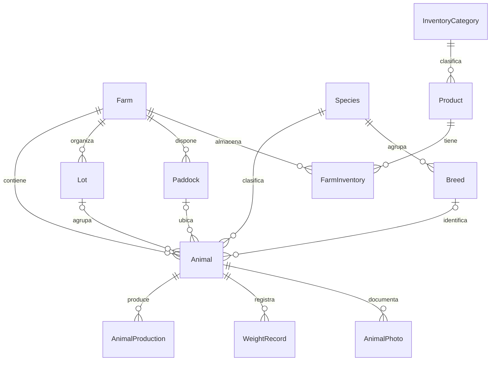
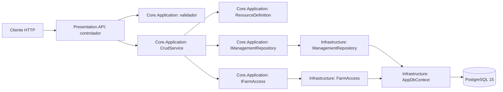

# Gestión ganadera: modelo de producción y operaciones de la API

## 1. Propósito del producto

El sistema organiza la información de una explotación ganadera por finca, especie, raza, lote y animal. Su objetivo es mantener identificaciones consistentes, registrar pesajes y rendimientos productivos, administrar insumos y permitir que cada usuario opere dentro de las fincas que tiene asignadas.

La información permanece en PostgreSQL. Un reinicio del proceso de la API no debe vaciar el catálogo ni eliminar los registros de negocio. Los datos de demostración permiten recorrer un caso completo: consultar una finca, identificar sus animales, registrar un rendimiento y verificar el resultado persistido.

Esta versión incorpora operaciones REST para once recursos, autenticación, permisos, acceso por finca y fotografías privadas. El modelo contiene entidades adicionales que servirán para ampliar salud clínica, reproducción, nutrición y finanzas; la existencia de esas entidades no significa que sus procesos estén disponibles como módulos completos.

## 2. Conceptos que se mantienen separados

| Concepto | Qué representa | Ejemplo | Entidad principal |
| --- | --- | --- | --- |
| Animal | Individuo identificado y asociado a una finca | Vaca Luna, identificación `DEMO-002` | `Animal` |
| Rendimiento productivo | Cantidad obtenida de un animal en una operación | 18,5 litros de leche en un ordeño | `AnimalProduction` |
| Insumo | Artículo utilizado en la explotación | Concentrado, sal mineral, vacuna | `Product` |
| Existencia por finca | Cantidad disponible de un insumo en una finca concreta | 40 sacos de concentrado en el almacén principal | `FarmInventory` |
| Categoría de insumos | Clasificación administrativa del catálogo | Alimentación animal, sanidad animal | `InventoryCategory` |
| Operación productiva | Identificador que reúne los rendimientos de un mismo hecho | Carne y piel obtenidas en el mismo sacrificio | `OperationId` en `AnimalProduction` |

Esta separación evita que un litro de leche producido se confunda con un litro de desparasitante en almacén. Los dos utilizan una unidad de medida, pero tienen propietarios, reglas y procesos diferentes.

`Product` conserva precio y costo del insumo. `AnimalProduction` conserva cantidad, unidad, fecha y método del rendimiento. Registrar una producción no crea una venta, no calcula ingresos y no incrementa automáticamente el inventario de insumos.

**Código:** [catálogos e inventario](../src/Core.Domain/Livestock/Catalogs.cs), [producción](../src/Core.Domain/Livestock/Production.cs), [animales](../src/Core.Domain/Livestock/Animals.cs).

## 3. Relaciones del núcleo operativo



La relación animal–producción es **1:N**: un animal puede tener muchos registros productivos y cada registro pertenece a un animal. Un registro productivo no representa una especie completa ni un lote entero. Su `AnimalId` conserva la trazabilidad individual.

Una raza pertenece a una especie. Un lote pertenece a una finca y una especie. Un animal puede carecer de raza, lote o potrero, porque esas referencias son opcionales; cuando se proporcionan, deben corresponder a su finca y especie.

La identificación interna, identificación oficial y RFID se restringen por finca mediante índices compuestos. Así se evita registrar dos veces el mismo identificador dentro de una explotación, conservando la posibilidad de que explotaciones independientes utilicen códigos internos iguales.

Los identificadores de las entidades del dominio son `Guid`, almacenados como `uuid`. Los nombres de tablas, longitudes, relaciones e índices se especifican en configuraciones de EF Core; esas instrucciones no se colocan en las entidades del dominio.

## 4. Producción unificada

### 4.1. Una fila representa un rendimiento

La entidad `AnimalProduction` utiliza los siguientes campos:

| Campo | Función | Regla relevante |
| --- | --- | --- |
| `Id` | Identifica la fila de rendimiento | UUID de la entidad |
| `FarmId` | Identifica la finca propietaria | Debe coincidir con la finca del animal |
| `AnimalId` | Identifica el animal productor | Referencia obligatoria a un animal existente |
| `OperationId` | Agrupa los rendimientos de una misma operación | UUID obligatorio, distinto de `Id` |
| `Date` | Fecha del hecho productivo | Obligatoria, sin fecha futura ni anterior al nacimiento conocido |
| `ProductType` | Tipo de rendimiento obtenido | Enumeración `AnimalProductType` |
| `Method` | Método utilizado para obtenerlo | Enumeración `ProductionMethod` |
| `Quantity` | Cantidad obtenida | Mayor que cero, `numeric(14,4)` |
| `Unit` | Unidad de la cantidad | Compatible con el tipo y método |
| `Notes` | Observaciones del registro | Hasta 1000 caracteres |
| `CreatedAt` | Fecha de creación del registro informático | Distingue la carga del dato de la fecha del hecho |

El modelo utiliza una estructura común para leche, lana, carne, huevos, piel y otros rendimientos. Esa decisión concentra la validación, las consultas, los permisos y el mantenimiento del historial en un recurso productivo único.

**Código:** `AnimalProduction` en [Production.cs](../src/Core.Domain/Livestock/Production.cs), `ProductionRequest` en [Contracts.cs](../src/Core.Application/Management/Contracts.cs) y `AnimalProductionConfiguration` en [ProductionConfigurations.cs](../src/Infrastructure/Persistence/Configurations/Livestock/ProductionConfigurations.cs).

### 4.2. Tipo, método y unidad

| Tipo (`ProductType`) | Método (`Method`) | Unidad (`Unit`) | Condición adicional |
| --- | --- | --- | --- |
| `Milk` | `Milking` | `Liter` | Animal hembra de especie bovina, caprina u ovina |
| `Wool` | `Shearing` | `Kilogram` | Especie ovina |
| `Meat` | `Slaughter` | `Kilogram` | Operación de sacrificio compatible con el historial del animal |
| `Hide` | `Slaughter` | `Unit` | Cantidad entera y misma operación cuando acompaña a otro rendimiento |
| `Eggs` | `Collection` | `Unit` | Ave hembra y cantidad entera |
| `Other` | `Collection` o `Slaughter` | `Unit`, `Kilogram` o `Liter` | Cantidad entera cuando la unidad es `Unit` |

`ProductionRequestValidator` valida combinaciones y cantidades antes de procesar el comando. `ProductionDefinition` comprueba especie, sexo, pertenencia a finca, fechas e historial consultando los registros existentes.

Una unidad puede tener decimales físicamente significativos: 18,5 litros o 3,2 kilogramos. Una cantidad expresada en unidades debe ser entera: no se admite registrar 1,5 huevos.

### 4.3. Por qué existe `OperationId`

Un sacrificio puede producir carne y piel. Dos filas permiten conservar cantidades y unidades diferentes sin crear columnas específicas para cada posible rendimiento:

| `OperationId` | Animal | Tipo | Cantidad | Unidad | Método |
| --- | --- | --- | --- | --- | --- |
| Operación A | Animal X | `Meat` | 28 | `Kilogram` | `Slaughter` |
| Operación A | Animal X | `Hide` | 1 | `Unit` | `Slaughter` |

Los identificadores de las filas son diferentes, pero el identificador de operación es compartido. El índice único `(OperationId, ProductType)` impide duplicar un mismo tipo de rendimiento dentro de esa operación.

La aplicación exige que las filas de una operación compartan animal, finca, fecha y método. Reutilizar una operación para otro animal devuelve un conflicto. El identificador no se utiliza como permiso: conocerlo no autoriza consultar ni modificar registros de otra finca.

`OperationId` es actualmente una agrupación lógica, no una tabla independiente de operaciones. Los atributos comunes se conservan en las filas de rendimiento y su coherencia se comprueba en el caso de uso. Esta decisión debe considerarse al ampliar el modelo hacia operaciones con más participantes o controles de concurrencia adicionales.

### 4.4. Estado del animal después del sacrificio

El primer rendimiento válido de una operación `Slaughter` marca al animal como `Dead`. El caso de uso se ejecuta dentro de `IManagementRepository.ExecuteWriteAsync`, que abre una transacción con aislamiento `Serializable` antes de consultar las reglas. `SaveAsync` guarda el cambio de estado, el rendimiento y su auditoría; la envoltura confirma la transacción cuando termina toda la operación.

La aplicación admite agregar otro tipo de rendimiento a esa misma operación. Por ejemplo, registrar primero carne y después piel no implica dos sacrificios. Una operación de sacrificio distinta para el mismo animal se rechaza.

Las reglas de fechas preservan la secuencia del historial:

- El sacrificio no puede preceder a una producción no derivada de sacrificio que ya esté registrada.
- El sacrificio tampoco puede fecharse antes de un pesaje vivo ya registrado. Un pesaje previo del mismo día puede conservarse, porque la medición se registró antes de incorporar el sacrificio.
- Después del sacrificio no se admite ordeño, esquila o recolección en la misma fecha ni en fechas posteriores.
- Se puede cargar retrospectivamente una producción anterior al sacrificio cuando el historial lo permite.
- Un registro productivo existente conserva animal, operación, método y fecha. Se permite corregir su rendimiento dentro de las reglas de validación.
- Un sacrificio no se elimina mediante el CRUD ordinario; su reversión necesita un proceso específico que preserve trazabilidad.
- Un animal con historial de sacrificio no puede volver al estado activo mediante una edición general.

Ser administrador habilita una operación HTTP sensible, pero no elimina estas reglas de negocio. Una solicitud de eliminación autorizada puede devolver `409 Conflict` cuando destruiría un hecho irreversible o un historial protegido.

### 4.5. Ejemplo de solicitud

Los valores entre `<...>` deben sustituirse por identificadores obtenidos de la API. Este ejemplo describe el contrato; no contiene identificadores del ambiente local.

```http
POST /api/production
Authorization: Bearer <accessToken>
Content-Type: application/json
```

```json
{
  "farmId": "<farmId>",
  "animalId": "<animalId>",
  "date": "<fecha YYYY-MM-DD>",
  "productType": "Milk",
  "method": "Milking",
  "quantity": 18.5,
  "unit": "Liter",
  "operationId": "<UUID nuevo de la operación>",
  "notes": "Ordeño de la mañana"
}
```

Una solicitud válida devuelve `201 Created`, el identificador creado y su representación. Después debe consultarse `GET /api/production/{id}` para comprobar el registro guardado. Para demostrar persistencia, la lectura debe repetirse después de reiniciar la API manteniendo la misma base de datos.

## 5. Catálogo de insumos y existencias por finca

### 5.1. Datos propios del producto

`Product` contiene `SKU`, `Name`, `CategoryId`, `Price`, `CostPrice`, `Unit`, `Brand`, `WithdrawalDays`, `RequiresPrescription` e `IsActive`.

El SKU se limpia y normaliza a mayúsculas antes de guardarse. El índice único constituye la última protección contra duplicados, incluyendo solicitudes concurrentes. La categoría se obtiene mediante una referencia, de modo que una modificación en su descripción no requiere editar todos sus productos.

`Price` y `CostPrice` utilizan `decimal` en C# y `numeric(18,2)` en PostgreSQL. La precisión representa 18 dígitos totales, de los cuales 2 son decimales. Los validadores rechazan importes no positivos y cantidades con una escala incompatible; la base de datos también restringe precios de productos activos.

### 5.2. Datos que cambian entre fincas

`FarmInventory` contiene `FarmId`, `ProductId`, `Stock`, `MinStock`, `MaxStock` y `Location`.

El stock de un insumo no es una característica global del artículo: una finca puede tener 40 sacos y otra 12. Los umbrales y la ubicación también pueden ser diferentes. Por eso esos atributos pertenecen a la asociación finca–producto.

El índice único `(FarmId, ProductId)` permite una única existencia actual para un producto dentro de una finca. El mismo producto sí puede aparecer en varias fincas.

| Atributo | Valor inicial | Condición |
| --- | --- | --- |
| `Stock` | `0` en la base de datos | Mayor o igual que cero |
| `MinStock` | `5` | Mayor o igual que cero |
| `MaxStock` | `100` | Estrictamente mayor que `MinStock` |
| `Location` | `Main warehouse` | Texto obligatorio, hasta 150 caracteres |
| `Product.Unit` | `Unit` en la base de datos | Enumeración de unidad válida |
| `Product.Brand` | `Generic` | Texto obligatorio, hasta 100 caracteres |

Los valores por defecto existen en el modelo/configuración y los DTOs correspondientes. No equivalen a una inferencia automática de la unidad real del insumo: al registrar un producto, el operador debe seleccionar la unidad adecuada.

EF Core utiliza valores centinela explícitos para no confundir valores válidos con valores omitidos: `MinStock = 0` debe conservarse y `MeasurementUnit.Kilogram`, cuyo valor enum es cero, debe guardarse como kilogramo. Los centinelas `-1` separan esos valores válidos de los defaults de la base de datos.

`MaxStock` es un umbral operativo; la regla implementada exige que supere el mínimo, pero no impide que el stock actual sea mayor que ese umbral. Esta versión tampoco genera automáticamente una alerta cuando el stock cae por debajo del mínimo.

### 5.3. Relación con la tercera forma normal

La separación del catálogo y las existencias reduce anomalías de actualización:

- Los atributos descriptivos del artículo dependen del producto.
- Las existencias, umbrales y ubicación dependen del par finca–producto.
- El nombre de la categoría se almacena en su tabla y se referencia desde el producto.

Guardar esos datos en una sola fila global de producto obligaría a sobrescribir el stock al incorporar otra finca o a duplicar precio, marca y descripción por cada explotación. El diseño permite modificar la existencia de una finca sin alterar el catálogo compartido.

Esta explicación justifica la normalización del catálogo e inventario. No afirma que todo el esquema, incluidas agrupaciones productivas e historiales, haya sido formalmente demostrado en tercera forma normal.

### 5.4. Integridad al eliminar

La relación categoría–producto utiliza `DeleteBehavior.Restrict`. Una categoría utilizada por productos no se elimina en cascada. También son restrictivas las relaciones de `FarmInventory` hacia finca y producto.

Eliminar un producto con existencias asociadas devuelve un conflicto de integridad. La alternativa operativa es desactivarlo o resolver sus referencias mediante un proceso explícito. Cambiar la unidad de un producto que ya tiene existencias se rechaza para evitar reinterpretar cantidades almacenadas.

Las entidades de otros módulos tienen sus propias configuraciones de eliminación. La política del núcleo descrito aquí debe comprobarse en su configuración y en la migración; no se deduce de que una entidad tenga una propiedad `FarmId`.

## 6. Arquitectura de las operaciones



### 6.1. Responsabilidades de cada capa

| Capa | Responsabilidad concreta | Ejemplos |
| --- | --- | --- |
| `Core.Domain` | Representar información y vocabulario del negocio | `Animal`, `AnimalProduction`, `Product`, `FarmInventory`, enumeraciones |
| `Core.Application` | Definir contratos, casos de uso y reglas de entrada/coherencia | `CrudService`, `ProductionDefinition`, validadores, `IFarmAccess` |
| `Infrastructure` | Implementar persistencia, identidad, permisos y almacenamiento | `ManagementRepository`, `AppDbContext`, `AuthService`, `LocalFileStorage` |
| `Presentation.API` | Interpretar HTTP, autorizar acciones y transformar resultados | Controladores, filtros y `ExceptionMiddleware` |

`Core.Application` no necesita conocer `DbContext`, Npgsql o el sistema de archivos. Trabaja con interfaces. La implementación de esas interfaces se registra mediante inyección de dependencias en la capa de composición.

### 6.2. `CrudService<TEntity, TRequest>`

El servicio común organiza listar, obtener, crear, actualizar y eliminar. Comparte el flujo de validación, acceso por finca y guardado, mientras las reglas particulares permanecen en la definición de cada recurso.

Una creación sigue esta secuencia:

1. Validar el DTO con FluentValidation.
2. Comprobar acceso a la finca solicitada cuando el recurso pertenece a una finca.
3. Crear la entidad del dominio.
4. Comprobar referencias, duplicados y reglas particulares con `CheckAsync`.
5. Aplicar los valores normalizados a la entidad.
6. Agregarla mediante `IManagementRepository`.
7. Guardar la unidad de trabajo y devolver el recurso.

Una actualización además obtiene la entidad existente con seguimiento, comprueba su finca original e impide trasladar el registro a otra finca mediante un `PUT` general. El traslado necesita su propio flujo porque afectaría historiales y referencias dependientes.

### 6.3. `ResourceDefinition<TEntity, TRequest>`

La definición aporta `Read`, `Apply`, `CheckAsync`, `BeforeDeleteAsync`, `FarmId` y `Scope`.

`ProductionDefinition` interpreta las reglas productivas; `AnimalDefinition` comprueba raza, lote, potrero, parentesco e identificaciones; `InventoryDefinition` comprueba finca, producto y unicidad del inventario. La aplicación conserva así reglas específicas sin repetir el flujo REST completo en cada controlador.

Este diseño no convierte las entidades del dominio en objetos capaces de consultar PostgreSQL. Las comprobaciones que necesitan persistencia usan el contrato `IManagementRepository` desde la capa de aplicación.

### 6.4. Repositorio y consultas especializadas

`ManagementRepository` implementa el puerto mediante EF Core. Sus lecturas utilizan `AsNoTracking`; las actualizaciones solicitan seguimiento de manera explícita. `SaveAsync` centraliza el guardado y convierte violaciones de unicidad o claves foráneas de PostgreSQL en conflictos de negocio.

`AnimalQueryService` es un adaptador de lectura especializado: devuelve nombres de finca, especie y raza, fotografías y último peso. Su interfaz está en `Core.Application` y su implementación en `Infrastructure`. Estas proyecciones requieren consultas diferentes del CRUD genérico.

Las listas y detalles de animales mantienen sus campos descriptivos e incluyen identificadores de finca/especie y referencias relevantes. Los identificadores permiten construir una edición sin deducir una clave a partir de un nombre visible.

**Código:** [CrudService.cs](../src/Core.Application/Management/CrudService.cs), [ResourceDefinitions.cs](../src/Core.Application/Management/ResourceDefinitions.cs), [ManagementRepository.cs](../src/Infrastructure/Persistence/ManagementRepository.cs), [AnimalQueryService.cs](../src/Infrastructure/Livestock/AnimalQueryService.cs).

## 7. Recursos y contratos HTTP

| Recurso | Ruta base | DTO de escritura | Particularidad |
| --- | --- | --- | --- |
| Fincas | `/api/farms` | `FarmRequest` | Creación/modificación administrativa |
| Especies | `/api/species` | `SpeciesRequest` | Catálogo compartido; código único |
| Razas | `/api/breeds` | `BreedRequest` | Asociadas a una especie |
| Potreros | `/api/paddocks` | `PaddockRequest` | Pertenecen a una finca |
| Lotes | `/api/lots` | `LotRequest` | Finca, especie y potrero opcional |
| Categorías de insumos | `/api/categories` | `CategoryRequest` | Creación/modificación exclusiva de administración |
| Productos/insumos | `/api/products` | `ProductRequest` | SKU, importes, categoría, unidad y marca |
| Existencias | `/api/inventory` | `InventoryRequest` | Stock y umbrales por finca–producto |
| Animales | `/api/animals` | `AnimalRequest` | Lecturas descriptivas y escritura validada |
| Producción | `/api/production` | `ProductionRequest` | Rendimientos por animal y operación |
| Pesajes | `/api/weights` | `WeightRequest` | Peso histórico por animal |

Cada recurso ofrece `GET` a la ruta base, `GET /{id}`, `POST`, `PUT /{id}` y `DELETE /{id}`. La ruta `/api/herds` es un alias de los lotes: usa el mismo controlador, persistencia y permisos; no mantiene una segunda colección independiente en memoria.

Los CRUD genéricos devuelven `ResourceResult<TRequest>`, con `id`, `createdAt` y `data`. Las lecturas de animales devuelven `AnimalListItem` o `AnimalDetail`, que son proyecciones descriptivas. Por tanto, no debe suponerse que todas las respuestas de detalle tienen un campo `data`.

| Resultado | Código habitual | Significado |
| --- | --- | --- |
| Lectura o actualización válida | `200` | Operación completada |
| Creación válida | `201` | Recurso creado y localización disponible |
| Eliminación válida | `204` | Recurso eliminado; respuesta sin contenido |
| Entrada inválida | `400` | Campos o combinaciones rechazados |
| Sin autenticación válida | `401` | Se necesita un token válido |
| Permiso/rol insuficiente | `403` | Identidad reconocida sin autorización para la acción |
| Recurso ausente o fuera del alcance visible | `404` | No se expone un registro accesible con ese identificador |
| Duplicado o incompatibilidad con historial | `409` | Conflicto de integridad o regla de negocio |
| Error inesperado | `500` | Fallo registrado internamente con mensaje público genérico |

## 8. Animales, parentesco y salud resumida

El registro de un animal valida que finca y especie estén activas, que la raza corresponda a la especie y que lote/potrero correspondan a la finca. Los identificadores se limpian y normalizan para impedir duplicados que sólo difieran por mayúsculas o espacios externos.

Si se proporciona madre o padre, se comprueba finca, especie, sexo y orden de nacimiento cuando las fechas son conocidas. También se recorre la ascendencia para impedir que una edición cree ciclos de parentesco.

Cuando otro animal ya referencia al registro como madre o padre, no se permite modificar su especie, sexo ni fecha de nacimiento. Esta restricción evita invalidar retrospectivamente las relaciones de las crías. También se protegen esos atributos cuando el animal tiene historial productivo.

Se conserva el endpoint compatible:

```http
PATCH /api/animals/{id}/health-status
Content-Type: application/json
Authorization: Bearer <accessToken>
```

```json
{
  "status": "InTreatment",
  "reason": "Seguimiento veterinario"
}
```

También existe `PATCH /api/animals/{id}/health`, que recibe `healthStatus` en lugar de `status`. Las dos rutas utilizan `AnimalHealthService`, exigen `animals.update` y aplican el mismo control de finca.

Un cambio de salud de un animal activo conserva estado anterior, estado nuevo, motivo y usuario responsable mediante `HealthStatusChange`. La misma regla de estado se aplica al PATCH de salud y al PUT general del animal: este último no permite eludir la restricción para animales muertos, vendidos o inactivos. Este estado resumido no reemplaza una consulta clínica, una vacunación ni un tratamiento con dosis y seguimiento. Esos procesos completos pertenecen a una ampliación posterior.

Al crear un pesaje se registra `RecordedByUserId` desde la identidad autenticada; editarlo conserva la autoría inicial. Su fecha no puede preceder al nacimiento conocido. La fecha de medición (`Date`) y el momento de registro informático (`CreatedAt`) cumplen funciones diferentes.

Las reglas respecto al sacrificio distinguen estos casos:

| Caso | Resultado |
| --- | --- |
| Registrar un peso con fecha anterior al sacrificio | Admitido si cumple las demás reglas, incluso como carga retrospectiva |
| Registrar un peso nuevo en la fecha de un sacrificio existente o después | Rechazado |
| Registrar un sacrificio anterior a la fecha de un peso existente | Rechazado |
| Conservar un peso registrado antes del sacrificio, en el mismo día | Admitido |
| Corregir ese registro previo del mismo día | Admitido sólo si conserva su fecha original y su `CreatedAt` es anterior al del sacrificio |

La corrección de un peso previo no permite transformar otro registro en un peso nuevo del día del sacrificio ni fecharlo después. `CreatedAt` establece el orden de incorporación al sistema; el cliente no lo proporciona en `WeightRequest`.

Crear/editar pesajes y rendimientos productivos también actualiza `Animal.UpdatedAt`, porque esos hechos aportan información reciente al expediente.

## 9. Seguridad por identidad, acción y finca

Una solicitud protegida debe superar tres controles distintos:

1. **Identidad:** autenticación mediante JWT firmado, con emisor, audiencia y expiración válidos.
2. **Acción:** permiso específico, como `animals.update` o `photos.get`; las acciones sensibles también requieren rol administrativo.
3. **Alcance:** pertenencia a la finca del registro mediante `IFarmAccess`.

Los roles `Admin` y `Administrador` ofrecen administración. `Employee` permite consultar y ejecutar operaciones diarias autorizadas, pero no eliminar registros ni mantener los catálogos de productos y categorías. `SoloLectura` recibe permisos `list`/`get`; esos permisos no autorizan cargar ni borrar fotografías.

`FarmAccess` consulta la cuenta activa y las relaciones `UserFarm` en la base de datos. Los usuarios administradores y superusuarios activos acceden a las fincas existentes; los demás acceden únicamente a sus asignaciones. Una cuenta inactiva pierde acceso aunque conserve un token emitido previamente. Un claim de administrador desactualizado no otorga por sí solo acceso a otras fincas.

Los catálogos compartidos —especies, razas, categorías y productos— no tienen un stock o propietario de finca. Las listas de animales, lotes, potreros, pesajes, producción e inventario sí aplican el alcance correspondiente.

**Código:** [IFarmAccess.cs](../src/Core.Application/Security/IFarmAccess.cs), [FarmAccess.cs](../src/Infrastructure/Security/FarmAccess.cs), [PermissionCatalog.cs](../src/Core.Application/Security/PermissionCatalog.cs), [SecurityServices.cs](../src/Infrastructure/Security/SecurityServices.cs).

## 10. Fotografías privadas

Las fotografías utilizan un flujo específico:

| Acción | Ruta | Control |
| --- | --- | --- |
| Cargar | `POST /api/animals/{id}/photo` | JWT, `photos.create` y finca accesible |
| Descargar | `GET /api/animals/{id}/photos/{photoId}/content` | JWT, `photos.get` y finca accesible |
| Eliminar | `DELETE /api/animals/{id}/photos/{photoId}` | Rol administrativo, `photos.delete` y finca accesible |

Los bytes se guardan en disco; los metadatos se guardan en PostgreSQL. `AnimalPhoto.FileName` conserva el nombre aleatorio asignado por el almacenamiento, y `AnimalPhoto.Url` apunta al endpoint privado. La descarga no utiliza la URL pública como una ruta física.

`LocalFileStorage` permite JPEG, PNG y WebP, asigna la extensión a partir del tipo admitido, comprueba la firma inicial del archivo y limita su tamaño durante la lectura. Se rechazan rutas absolutas, segmentos `..` y nombres que permitan salir del directorio de almacenamiento. Si una carga falla durante la escritura, se elimina el archivo parcial.

La descarga vuelve a comprobar el formato del archivo guardado y responde con un tipo de imagen conocido, `X-Content-Type-Options: nosniff` y `Cache-Control: private, no-store`. La carpeta de archivos no debe publicarse como un directorio estático sin autorización.

El control de firma identifica el formato inicial; no realiza una decodificación completa de la imagen ni análisis antivirus. Esta versión tampoco transforma resolución o elimina metadatos EXIF. Esos límites deben considerarse cuando se incorpore procesamiento de imágenes más avanzado.

Los archivos y PostgreSQL son dos recursos diferentes. La aplicación intenta retirar el archivo si falla el guardado de metadatos. En una eliminación, guarda primero la eliminación de los metadatos y después retira el archivo: un fallo de disco puede dejar un archivo huérfano, aunque la API ya no lo exponga. No se presenta este flujo como una transacción distribuida.

Un cliente que muestre una imagen privada debe descargarla con su token; insertar la URL en una etiqueta `img` no agrega automáticamente un encabezado Bearer. El cliente puede obtener los bytes autenticados y construir una URL de objeto para su visualización.

## 11. Persistencia, lectura y trazabilidad

Los registros operativos se escriben en `AppDbContext` mediante EF Core/Npgsql. `AsNoTracking` evita conservar entidades de lectura en el rastreador de cambios; no convierte una consulta en una lectura sin base de datos ni habilita una caché en memoria.

`AppDbContext` actualiza `Animal.UpdatedAt` cuando una entidad animal se modifica. La consulta `/api/animals/stale?days=30` identifica registros que no se han actualizado durante ese intervalo. Es una herramienta para revisar información antigua, no una detección automática de enfermedad.

`ManagementRepository.SaveAsync` añade registros `AuditLog` para cambios CRUD de entidades del dominio, con usuario, acción, entidad y valores anteriores/nuevos. Los valores se almacenan como `jsonb`. El mecanismo actual no representa una auditoría exhaustiva de autenticación, administración de permisos, siembra y acceso a fotografías.

Los comandos de `CrudService` y `AnimalHealthService` se ejecutan mediante `IManagementRepository.ExecuteWriteAsync`. La implementación de Infrastructure abre una transacción relacional `Serializable`, ejecuta el caso de uso y confirma cuando toda la operación termina. Así, las consultas que comprueban el historial y la escritura posterior forman una misma operación aislada.

La envoltura reconoce fallas de serialización `40001` e interbloqueos `40P01` de PostgreSQL, incluso cuando llegan dentro de excepciones anidadas de EF Core. Esos rechazos se convierten en `409 Conflict` con la indicación de actualizar y reintentar, tanto si aparecen al consultar como al guardar o confirmar. El cliente no recibe un éxito para una escritura que PostgreSQL rechazó. `BeginWriteAsync` es un detalle privado de Infrastructure; el contrato de Application no expone el tipo de transacción de EF.

La transacción incluye cambios operativos y entradas de auditoría guardados por el repositorio. El adaptador de pruebas InMemory no ejecuta una transacción relacional; las propiedades de aislamiento deben comprobarse también contra PostgreSQL. Las descargas y los archivos físicos siguen siendo un recurso separado de esa transacción.

## 12. Alcance disponible y ampliaciones

| Área | Disponible en esta versión | Ampliación posterior |
| --- | --- | --- |
| Catálogos y organización | CRUD de fincas, especies, razas, potreros, lotes y categorías | Administración más amplia de catálogos especializados |
| Animales | CRUD, relaciones de parentesco, estado de salud, fotografías y lecturas descriptivas | Transferencias formales y expedientes más completos |
| Producción | Rendimientos unificados, operación compartida y reglas de sacrificio | Costeo, ventas, resúmenes y operaciones con varios animales |
| Inventario | Productos y existencia actual por finca, con umbrales | Movimientos de entrada/salida integrados y alertas automáticas |
| Pesajes | CRUD y lectura del último peso | Indicadores históricos y análisis de crecimiento |
| Salud clínica | Estado resumido e historial de cambios | CRUD completo de tratamientos, vacunaciones y eventos clínicos |
| Reproducción | Entidades y relaciones persistentes del modelo | Casos de uso y endpoints completos de reproducción |
| Finanzas | Entidades y precisión monetaria configurada | Operaciones financieras, conciliación y reportes |
| Usuarios/permisos | Registro, login, refresh, perfil, consulta de roles/permisos y asignación/revocación administrativa de permisos a roles | Administración completa de usuarios y asignaciones de finca desde interfaz |
| Interfaz | Base web y documentación interactiva de la API | Pantallas de operación completas para los once recursos |

El aislamiento serializable protege la comprobación y escritura de reglas temporales ante operaciones simultáneas. Su coste es que una petición concurrente puede requerir un reintento explícito. Los índices únicos aportan otra protección para duplicados concretos; las verificaciones de concurrencia contra PostgreSQL deben registrarse junto con las demás evidencias de ejecución.

Para preparar y ejecutar el ambiente se utiliza la [guía de instalación](setup.md). La relación entre estas capacidades y los criterios académicos se documenta por separado en [fases 2 y 3](fases-2-y-3.md).
