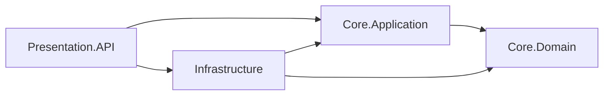

# Phase 1 Product and Technical Guide

## Purpose and evidence boundary

This guide explains the Group 3 cattle management prototype as it exists in Phase 1. It connects the course concepts of Onion Architecture, dependency injection, domain modeling, and RFC 7807 to specific code and repeatable demonstrations. It also separates the intended product from what the current prototype actually delivers.

The professor's Phase 1 assignment asks for four projects (`Core.Domain`, `Core.Application`, `Infrastructure`, and `Presentation.API`), a pure domain, a GUID/UTC base entity, two related business entities, appropriate DI lifetimes, a registered exception middleware, RFC 7807 responses for specified exceptions, a demonstration endpoint, build instructions, and Postman evidence. This guide describes evidence for those requirements; it does not claim a grade or replace the course submission screenshot.

## Product proposition

**Operational question:** Which animals are registered, which herd does each belong to, and what is its current health status?

**Intended users:** People responsible for recording and checking a cattle operation's animal inventory. This is a proposed use case for the product, not a claim that user research has been completed.

**Value demonstrated now:** The API assigns every herd and animal a GUID, associates each animal with a herd, normalizes ear tags, rejects a duplicate tag regardless of letter case, and allows a health status change. These behaviors give the team a concrete workflow to demonstrate rather than an empty architecture diagram.

**Current product boundary:** The records are held in a process-local in-memory store. Restarting the server deletes them. The Blazor home page describes the API; it does not offer cattle entry forms, dashboards, authentication, reports, or durable storage. Those capabilities must not be presented as delivered in Phase 1.

### Demonstrable workflow

1. Create a herd with `POST /api/herds`.
2. Register an animal with `POST /api/animals`, using the herd's returned `id`.
3. Retrieve that animal with `GET /api/animals/{id}` to show the herd relationship and initial `healthStatus` value `0` (`Healthy`).
4. Send `PATCH /api/animals/{id}/health-status` with `{"status":1}` and retrieve the animal again to show `UnderObservation`.
5. Repeat the registration with the same ear tag in different letter case to demonstrate a controlled 400 response.
6. Request an unknown animal to demonstrate a controlled 404, then invoke the Development-only unexpected-error endpoint to demonstrate a safe 500.

The executable version of this sequence is the [Postman collection](../postman/DAW-Phase1.postman_collection.json). Its `baseUrl` defaults to `http://localhost:18080`.

### HTTP contract used in the demonstration

| Method and route | Valid request or purpose | Success | Business failure raised by the application |
| --- | --- | --- | --- |
| `POST /api/herds` | `{"name":"North Pasture","description":"Breeding herd"}` | 201 with herd `id`, name, description, and UTC `createdAt`; `Location` identifies its GET route | Duplicate name or empty name → 400 |
| `GET /api/herds` | List registered herds | 200 with an array | None for an empty list |
| `GET /api/herds/{id}` | Retrieve one herd by GUID | 200 with one herd | Unknown GUID → 404 |
| `POST /api/animals` | `{"earTag":"C-001","breed":"Brahman","herdId":"<herd-guid>"}`; `dateOfBirth` is optional | 201 with normalized tag, herd information, initial numeric `healthStatus: 0`, and UTC `createdAt` | Unknown herd → 404; duplicate tag, missing required business text, or future birth date → 400 |
| `GET /api/animals` | List registered animals | 200 with an array | None for an empty list |
| `GET /api/animals/{id}` | Retrieve one animal by GUID | 200 with one animal | Unknown GUID → 404 |
| `PATCH /api/animals/{id}/health-status` | `{"status":1}`; `0` = healthy, `1` = under observation, `2` = in treatment | 200 with the updated animal | Unknown GUID → 404; undefined numeric status → 400 |
| `GET /api/demo/errors/{kind}` | Development-only `not-found`, `invalid-operation`, or `unexpected` | Deliberately raises a mapped exception | 404, 400, or safe 500, respectively |

`POST` returns 201 because a resource was created, `GET` reads resources, and `PATCH` changes only the health-status field. The table describes validly bound requests and business exceptions. Malformed JSON, invalid route shapes, and automatic MVC model-binding errors can follow framework behavior instead of the middleware's exception mapping.

## Theory 1: Onion Architecture and the dependency rule

The central idea of Onion Architecture is that business decisions should not depend on replaceable technical details such as HTTP, a database, or a UI framework. Source-code dependencies point inward. The outermost project may assemble the system, but inner projects cannot reference outer projects. This is the dependency inversion described by [Jeffrey Palermo](https://jeffreypalermo.com/2008/07/the-onion-architecture-part-1/).



The arrows show **compile-time project references**, not the order in which a request executes. The references are visible in the four `*.csproj` files and the [solution file](../DAW.slnx). `Core.Domain` has no project references or external NuGet dependencies. `Core.Application` references the domain and declares `ICattleRepository`. `Infrastructure` references the core projects and implements that interface. `Presentation.API` references application and infrastructure because `Program.cs` is the composition root that connects HTTP to the implementation.

At runtime, an HTTP request reaches a controller, which calls `ICattleCatalogService`. `CattleCatalogService` calls `ICattleRepository`; DI supplies `InMemoryCattleRepository`. This does not make application code depend on infrastructure code: the application only knows the repository **interface**. When Phase 2 introduces database persistence, the repository implementation can change while the use case and domain contracts remain conceptually stable.

| Layer | Actual responsibility in Phase 1 | Code evidence | What it must not know |
| --- | --- | --- | --- |
| `Core.Domain` | Animal and herd state, identity, relationship, health status behavior | [`BaseEntity`](../src/Core.Domain/Common/BaseEntity.cs), [`Herd`](../src/Core.Domain/Cattle/Herd.cs), [`Animal`](../src/Core.Domain/Cattle/Animal.cs) | ASP.NET Core controllers or repository implementation |
| `Core.Application` | Use cases, result contracts, repository abstraction, registration validation | [`CattleCatalogService`](../src/Core.Application/Cattle/CattleCatalogService.cs), [`ICattleRepository`](../src/Core.Application/Cattle/ICattleRepository.cs) | Concrete storage or HTTP request objects |
| `Infrastructure` | Temporary in-memory repository and shared storage | [`InMemoryCattleRepository`](../src/Infrastructure/Cattle/InMemoryCattleRepository.cs) | Controller routing or response formatting |
| `Presentation.API` | HTTP routing, DI composition, centralized error conversion | [`Program.cs`](../src/Presentation.API/Program.cs), [controllers](../src/Presentation.API/Controllers/AnimalsController.cs), [`ExceptionMiddleware`](../src/Presentation.API/Middleware/ExceptionMiddleware.cs) | Ownership of core business rules |

### Domain relationship and invariants

`BaseEntity` creates a non-empty `Guid` and a UTC `CreatedAt` timestamp. `Herd` has a required name. `Animal` has a required ear tag and breed, holds a `Herd` reference, exposes its `HerdId`, and starts with `Healthy` status. Conceptually, one herd can contain many animals; each registered animal belongs to one herd. `Animal.ChangeHealthStatus` rejects undefined enum values.

The application service checks that the referenced herd exists, normalizes the ear tag to uppercase, and rejects duplicates through the repository. The registration validator rejects an empty breed and a future birth date. This distinction matters in a defense: entity validation protects the object when constructed, while application validation protects the registration use case before it looks up the herd. The current `Animal` constructor does not independently reject a future birth date; that rule is enforced by the application path and is a documented boundary of this prototype.

The in-memory repository checks duplicate herd names and ear tags with a scan of existing records. It does not provide a database unique index or an `O(1)` uniqueness guarantee. Those belong to a later persistence design.

## Theory 2: Dependency injection and object lifetimes

DI lets `Program.cs` choose concrete implementations without requiring controllers or use cases to instantiate them directly. ASP.NET Core's native container provides `Transient`, `Scoped`, and `Singleton` lifetimes. A scoped service is reused within one request scope; a transient service is created for each resolution; a singleton is shared for the process lifetime. See [Microsoft's service lifetime documentation](https://learn.microsoft.com/en-us/dotnet/core/extensions/dependency-injection/service-lifetimes).

| Registration in `Program.cs` | Lifetime | Reason in this prototype | Verification |
| --- | --- | --- | --- |
| `ICattleCatalogService` → `CattleCatalogService` | Scoped | One use-case service instance per request; it uses the request's repository. | Same instance within one scope; different across scopes. |
| `ICattleRepository` → `InMemoryCattleRepository` | Scoped | A request-specific repository adapter; future database work can replace its implementation. | Same instance within one scope; different across scopes. |
| `IAnimalRegistrationValidator` → `AnimalRegistrationValidator` | Transient | Stateless validation can be resolved independently. | Different instance on repeated resolutions. |
| `IAnimalTagNormalizer` → `AnimalTagNormalizer` | Singleton | Stateless and immutable utility behavior is safe to reuse. | Same instance across scopes. |
| `InMemoryCattleStore` | Singleton | Keeps prototype records visible across requests. | Same instance across scopes. |

A **captive dependency** occurs when a longer-lived object retains a shorter-lived object, such as a singleton constructor taking a scoped repository. The registrations here do not form that pattern: the scoped repository and service may depend on the singleton store and normalizer, but the singleton objects do not depend on scoped services. [`DependencyInjectionUsesExpectedLifetimes`](../tests/Core.Tests/ApiIntegrationTests.cs) resolves services in separate scopes and checks the expected identity behavior.

The store is a deliberate **mutable singleton exception** to the usual preference for immutable singleton utilities. It uses a lock around its dictionaries, but its contents disappear on restart and it does not offer transactional durability. We use it to demonstrate cross-request behavior without implementing Phase 2 persistence early. A database-backed `DbContext` is not present in Phase 1; when introduced, it should be scoped to the request.

## Theory 3: Centralized HTTP errors and RFC 7807

Without a common boundary, each controller might catch and format exceptions differently. [`ExceptionMiddleware`](../src/Presentation.API/Middleware/ExceptionMiddleware.cs) is registered in `Program.cs` before controller endpoints, so exceptions raised later in the pipeline can be converted in one place. This is cross-cutting HTTP behavior and therefore belongs in the presentation layer, outside the domain.

| Exception | HTTP status | Response `title` | Example |
| --- | ---: | --- | --- |
| `KeyNotFoundException` | 404 | `Not Found` | An animal ID is unknown. |
| `InvalidOperationException` or `ArgumentException` | 400 | `Bad Request` | An ear tag already exists or input is invalid. |
| Other `Exception` | 500 | `Internal Server Error` | The Development-only demo throws an unexpected exception. |

The body uses the `application/problem+json` media type and the five [RFC 7807](https://www.rfc-editor.org/info/rfc7807/) members below:

| Member | Meaning in this implementation |
| --- | --- |
| `type` | `about:blank`, meaning the HTTP status itself identifies the generic problem type. |
| `title` | The standard reason phrase for the chosen status. |
| `status` | The numeric HTTP status code, matching the response status. |
| `detail` | A useful exception message for mapped 400/404; a generic message for 500. |
| `instance` | The request path where the failure occurred. |

For the unexpected-error demonstration, the response is equivalent to this example; the path is the actual request path:

```http
HTTP/1.1 500 Internal Server Error
Content-Type: application/problem+json

{"type":"about:blank","title":"Internal Server Error","status":500,"detail":"An unexpected error occurred.","instance":"/api/demo/errors/unexpected"}
```

The middleware logs unexpected exceptions on the server, clears an unstarted response, and returns a generic 500 detail. If headers have already been sent, it cannot safely replace that response and rethrows. The Development-only [`ErrorDemoController`](../src/Presentation.API/Controllers/ErrorDemoController.cs) deliberately raises exceptions for a repeatable demonstration; it returns 404 outside Development. The middleware covers **thrown exceptions**. It does not promise that every unrelated 400 or 404 generated by routing or model binding has this exact body.

## Verification strategy and evidence

The three test levels answer different questions:

| Level | What it proves | Where |
| --- | --- | --- |
| Domain and application unit tests | GUID/UTC identity, herd relationship, default and changed status, duplicate tag rejection, unknown herd, future birth date | [`DomainAndApplicationTests`](../tests/Core.Tests/DomainAndApplicationTests.cs) |
| Middleware unit tests | The middleware class maps thrown exceptions and hides unexpected details | [`ExceptionMiddlewareTests`](../tests/Core.Tests/ExceptionMiddlewareTests.cs) |
| HTTP integration tests | The real `Program.cs` host registers DI and middleware correctly; HTTP responses contain the required fields and media type | [`ApiIntegrationTests`](../tests/Core.Tests/ApiIntegrationTests.cs) |
| Postman/Newman | The published Docker image responds correctly across independent HTTP requests | [Phase 1 collection](../postman/DAW-Phase1.postman_collection.json) |

The latest recorded validation for the Phase 1 implementation was 11 passing .NET tests, a successful Docker image build, and 7 passing Newman requests/assertions. These are recorded results, not a promise that future revisions will pass without rerunning them. The documentation-only commits after that run were checked with `git diff --check`.

On a computer with the .NET 10 SDK, use `dotnet build DAW.slnx` and `dotnet test DAW.slnx`. On the project's Windows/Git Bash setup without a local SDK, use the Docker commands in the [README](../README.md#run-the-api). Run the application in Development for the demo endpoint, import the collection, and capture the 500 request's status, media type, and JSON body in Postman for the course submission. The collection file and screenshot are different deliverables.

## Phase 1 rubric traceability

| Assignment criterion | Maximum in the supplied practical rubric | Concrete evidence | What to show the professor |
| --- | ---: | --- | --- |
| Onion Architecture, DI, and dependency rule | 24 | `DAW.slnx`, `*.csproj` references, `ICattleRepository` in Application, implementation in Infrastructure, registrations in `Program.cs`, DI integration test | Open the project references; show Domain has none; explain each lifetime and the temporary shared store. |
| `BaseEntity` and faithful business entities | 16 | `BaseEntity`, `Herd`, `Animal`, `DomainAndApplicationTests` | Show `Animal.Herd`, `HerdId`, and the test checking GUID/UTC. |
| Exception middleware, RFC 7807, and pipeline | 28 | `Program.cs`, `ExceptionMiddleware`, three HTTP integration cases, Postman collection | Show middleware order and a 500 response without internal details. |
| Repository, documentation, and punctuality | 12 | README, this guide, conventional commits, collection | Run the collection and attach a separate Postman screenshot. Punctuality and submission state are decided outside the code. |

This maps implementation to the rubric; it does not assert the professor's eventual score. The practical rubric and the instructor's feedback remain the evaluation authority.

## Defense walkthrough

1. **Start with the need.** “The product records cattle by ear tag, relates each animal to a herd, and tracks its current health status. Today we are demonstrating the Phase 1 API foundation.”
2. **Show one useful transaction.** In Postman, create a herd, register an animal, retrieve it, and change its health status. Point to the returned GUID, UTC timestamp, normalized tag, herd ID, and status.
3. **Explain the architecture.** Open the solution and project references. Show that the domain knows neither ASP.NET Core nor storage; the application owns `ICattleRepository`; infrastructure implements it; the API assembles everything.
4. **Explain DI.** Open `Program.cs` and identify scoped business service/repository, transient validator, stateless singleton normalizer, and temporary shared store. Explain why no singleton captures a scoped dependency.
5. **Demonstrate resilience.** Run missing-animal 404, duplicate-tag 400, and unexpected 500. Inspect `Content-Type` and the five Problem Details fields; show that 500 hides the simulated internal message.
6. **Show evidence and limits.** Run or display the 11 .NET tests and the Postman collection. State plainly that Phase 1 data is in memory, that the UI is an overview, and that persistent storage and other later-phase features have not been delivered.

If asked why a database is absent, answer that the Phase 1 assignment evaluates domain separation, DI, and error handling; the current store makes those behaviors observable while the persistence design is reserved for Phase 2. If asked why the store is singleton, explain that independent HTTP requests must share prototype state and that the scoped repository depends on this thread-safe shared store, never the reverse.

## Source references

- Jeffrey Palermo, [The Onion Architecture: Part 1](https://jeffreypalermo.com/2008/07/the-onion-architecture-part-1/).
- Microsoft Learn, [Service lifetimes](https://learn.microsoft.com/en-us/dotnet/core/extensions/dependency-injection/service-lifetimes).
- RFC Editor, [RFC 7807: Problem Details for HTTP APIs](https://www.rfc-editor.org/info/rfc7807/).
