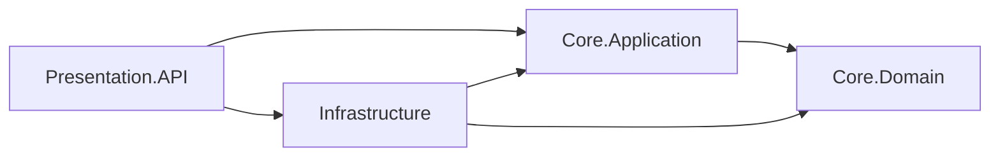

# Guía del producto y su implementación técnica: gestión de ganado

## Descripción del producto

El sistema de gestión de ganado permite registrar animales, organizarlos en hatos y consultar su estado de salud actual. Un hato es un grupo de animales, representado en el código por la entidad `Herd`. La API HTTP respalda este flujo con identificadores consistentes, validación de registros y un contrato de errores predecible.

Esta guía describe la versión actual, las necesidades operativas que atiende y los principios de arquitectura que sustentan su implementación. Relaciona la arquitectura Onion, la inyección de dependencias, el modelado del dominio y RFC 7807 con el código y con comprobaciones reproducibles.

## Propuesta de valor

**Necesidad operativa:** Saber qué animales están registrados, a qué hato pertenece cada uno y cuál es su estado de salud actual.

**Usuarios previstos:** Personas responsables de registrar y consultar el inventario de animales de una explotación ganadera y su estado de salud actual.

**Capacidades disponibles:** La API asigna un GUID a cada hato y animal, asocia cada animal con un hato, normaliza los aretes, rechaza aretes duplicados sin distinguir mayúsculas y minúsculas, y permite cambiar el estado de salud. Quien utiliza el sistema puede identificar un registro de forma consistente, consultar su pertenencia a un hato y actualizar la condición actual del animal.

**Limitaciones de la versión actual:** Los registros se guardan en la memoria del proceso y se eliminan al reiniciar el servidor. La página de inicio de Blazor presenta un resumen de la API. Todavía no están implementados los formularios de registro de ganado, los paneles de gestión, la autenticación, los informes ni el almacenamiento persistente. Esta versión permite evaluar el flujo de la API en un entorno de desarrollo; no conserva registros operativos de forma duradera.

### Flujo de registro de ganado y actualización de salud

1. Crear un hato con `POST /api/herds`.
2. Registrar un animal con `POST /api/animals`, utilizando el `id` devuelto al crear el hato.
3. Consultar el animal con `GET /api/animals/{id}` para comprobar su relación con el hato y el valor inicial de `healthStatus`: `0` (`Healthy`, sano).
4. Enviar `PATCH /api/animals/{id}/health-status` con `{"status":1}` y consultar de nuevo el animal para verificar `UnderObservation`, es decir, en observación.
5. Repetir el registro con el mismo arete cambiando sus mayúsculas y minúsculas para comprobar que se rechaza el duplicado con una respuesta 400 controlada.
6. Consultar un animal inexistente para comprobar la respuesta 404 y utilizar el endpoint de error inesperado, disponible solo en Development, para inspeccionar una respuesta 500 que oculta los detalles internos.

La [colección de Postman](../postman/Cattle-Management.postman_collection.json) ejecuta esta secuencia. Su variable `baseUrl` tiene como valor predeterminado `http://localhost:18080`.

### Contrato de la API HTTP

| Método y ruta | Petición válida o propósito | Respuesta exitosa | Error de negocio generado por la aplicación |
| --- | --- | --- | --- |
| `POST /api/herds` | `{"name":"North Pasture","description":"Breeding herd"}` | 201 con `id`, nombre, descripción y fecha UTC `createdAt` del hato; `Location` identifica su ruta de consulta GET | Nombre duplicado o vacío → 400 |
| `GET /api/herds` | Listar los hatos registrados | 200 con un arreglo | Una lista vacía no produce un error |
| `GET /api/herds/{id}` | Consultar un hato por GUID | 200 con un hato | GUID inexistente → 404 |
| `POST /api/animals` | `{"earTag":"C-001","breed":"Brahman","herdId":"<herd-guid>"}`; `dateOfBirth` es opcional | 201 con el arete normalizado, información del hato, estado numérico inicial `healthStatus: 0` y fecha UTC `createdAt` | Hato inexistente → 404; arete duplicado, textos obligatorios ausentes o fecha de nacimiento futura → 400 |
| `GET /api/animals` | Listar los animales registrados | 200 con un arreglo | Una lista vacía no produce un error |
| `GET /api/animals/{id}` | Consultar un animal por GUID | 200 con un animal | GUID inexistente → 404 |
| `PATCH /api/animals/{id}/health-status` | `{"status":1}`; `0` = sano, `1` = en observación, `2` = en tratamiento | 200 con el animal actualizado | GUID inexistente → 404; valor numérico de estado no definido → 400 |
| `GET /api/demo/errors/{kind}` | Solo en Development: `not-found`, `invalid-operation` o `unexpected` | Provoca intencionalmente una excepción contemplada por el middleware | 404, 400 o 500 con detalle genérico, respectivamente |

`POST` devuelve 201 porque crea un recurso, `GET` consulta recursos y `PATCH` modifica únicamente el estado de salud. La tabla describe peticiones cuyos datos se han enlazado correctamente y excepciones de negocio. Un JSON mal formado, una ruta inválida o un error del enlace automático de modelos de MVC puede seguir el comportamiento del framework en lugar del mapeo de excepciones del middleware.

## Arquitectura Onion y regla de dependencias

La idea central de la arquitectura Onion es que las decisiones del negocio no dependan de detalles técnicos sustituibles, como HTTP, una base de datos o un framework de interfaz. Las dependencias del código apuntan hacia el interior. La capa externa puede ensamblar el sistema, pero las capas internas no deben referenciar las externas. Este principio corresponde a la inversión de dependencias descrita por [Jeffrey Palermo](https://jeffreypalermo.com/2008/07/the-onion-architecture-part-1/).



Las flechas representan **referencias entre proyectos durante la compilación**. El orden de ejecución de una petición se describe por separado. Las referencias pueden consultarse en los cuatro archivos `*.csproj` y en el [archivo de la solución](../DAW.slnx). `Core.Domain` no referencia otros proyectos ni paquetes NuGet externos. `Core.Application` referencia el dominio y declara `ICattleRepository`. `Infrastructure` referencia los proyectos del núcleo e implementa esa interfaz. `Presentation.API` referencia aplicación e infraestructura porque `Program.cs` es el punto de composición: allí se conectan los componentes HTTP con sus implementaciones.

Durante la ejecución, una petición HTTP llega a un controlador que llama a `ICattleCatalogService`. `CattleCatalogService` llama a `ICattleRepository`, y DI proporciona `InMemoryCattleRepository`. La aplicación depende de la **interfaz** del repositorio, que describe las operaciones necesarias para el flujo ganadero. Un futuro adaptador de base de datos puede implementar ese contrato y mantener el modelo del núcleo independiente de la tecnología de almacenamiento.

| Capa | Responsabilidad actual | Evidencia en el código | Detalles de los que debe permanecer independiente |
| --- | --- | --- | --- |
| `Core.Domain` | Estado, identidad y relación de animales y hatos; comportamiento del estado de salud | [`BaseEntity`](../src/Core.Domain/Common/BaseEntity.cs), [`Herd`](../src/Core.Domain/Cattle/Herd.cs), [`Animal`](../src/Core.Domain/Cattle/Animal.cs) | Controladores de ASP.NET Core e implementación del repositorio |
| `Core.Application` | Casos de uso, contratos de resultados, abstracción del repositorio y validación de registros | [`CattleCatalogService`](../src/Core.Application/Cattle/CattleCatalogService.cs), [`ICattleRepository`](../src/Core.Application/Cattle/ICattleRepository.cs) | Almacenamiento concreto y objetos de petición HTTP |
| `Infrastructure` | Repositorio temporal en memoria y almacenamiento compartido | [`InMemoryCattleRepository`](../src/Infrastructure/Cattle/InMemoryCattleRepository.cs) | Enrutamiento de controladores y formato de respuestas |
| `Presentation.API` | Enrutamiento HTTP, composición de DI y conversión centralizada de errores | [`Program.cs`](../src/Presentation.API/Program.cs), [controladores](../src/Presentation.API/Controllers/AnimalsController.cs), [`ExceptionMiddleware`](../src/Presentation.API/Middleware/ExceptionMiddleware.cs) | Definición de las reglas del negocio que corresponden al núcleo |

### Relación del dominio y reglas que deben mantenerse

`BaseEntity` crea un `Guid` no vacío y una fecha `CreatedAt` en UTC. `Herd` exige un nombre. `Animal` exige un arete y una raza, mantiene una referencia a `Herd`, expone su `HerdId` y comienza con el estado `Healthy`, sano. Conceptualmente, un hato puede contener muchos animales y cada animal registrado pertenece a un hato. `Animal.ChangeHealthStatus` rechaza valores no definidos en la enumeración.

El servicio de aplicación comprueba que exista el hato indicado, normaliza el arete a mayúsculas y rechaza duplicados mediante el repositorio. El validador de registros rechaza una raza vacía y una fecha de nacimiento futura. La validación de la entidad protege el objeto al construirlo; la validación de aplicación protege el caso de uso de registro antes de buscar el hato. El constructor actual de `Animal` no rechaza por sí mismo una fecha de nacimiento futura: se debe utilizar el flujo de registro de la aplicación para aplicar esa regla.

El repositorio en memoria detecta nombres de hatos y aretes duplicados recorriendo los registros existentes. No ofrece un índice único de base de datos ni garantiza una comprobación de unicidad `O(1)`. Estas decisiones corresponden a un diseño posterior de persistencia.

## Inyección de dependencias y ciclos de vida de los objetos

La inyección de dependencias, o DI, permite que `Program.cs` seleccione implementaciones concretas sin obligar a los controladores o casos de uso a crearlas directamente. El contenedor nativo de ASP.NET Core ofrece los ciclos de vida `Transient`, `Scoped` y `Singleton`. Un servicio scoped se reutiliza dentro del ámbito de una petición; un servicio transient se crea cada vez que se solicita al contenedor; un singleton se comparte durante la vida del proceso. Véase la [documentación de Microsoft sobre ciclos de vida](https://learn.microsoft.com/en-us/dotnet/core/extensions/dependency-injection/service-lifetimes).

| Registro en `Program.cs` | Ciclo de vida | Propósito | Verificación |
| --- | --- | --- | --- |
| `ICattleCatalogService` → `CattleCatalogService` | Scoped | Una instancia del servicio de casos de uso por petición; utiliza el repositorio de esa petición. | Misma instancia dentro de un ámbito y distinta entre ámbitos. |
| `ICattleRepository` → `InMemoryCattleRepository` | Scoped | Adaptador de repositorio por petición; una futura implementación puede utilizar una base de datos. | Misma instancia dentro de un ámbito y distinta entre ámbitos. |
| `IAnimalRegistrationValidator` → `AnimalRegistrationValidator` | Transient | La validación sin estado compartido puede obtenerse de forma independiente. | Instancias distintas al solicitarlo repetidamente. |
| `IAnimalTagNormalizer` → `AnimalTagNormalizer` | Singleton | Una utilidad sin estado mutable puede reutilizarse. | Misma instancia entre ámbitos. |
| `InMemoryCattleStore` | Singleton | Mantiene los registros ganaderos disponibles entre peticiones. | Misma instancia entre ámbitos. |

Una **dependencia cautiva** aparece cuando un objeto de vida larga retiene otro de vida más corta. Un ejemplo sería que el constructor de un singleton recibiera un repositorio scoped. Los registros del sistema evitan ese patrón: el repositorio y el servicio scoped pueden depender del almacén y del normalizador singleton, pero los objetos singleton no dependen de servicios scoped. La prueba [`DependencyInjectionUsesExpectedLifetimes`](../tests/Core.Tests/ApiIntegrationTests.cs) obtiene servicios desde ámbitos separados y comprueba si las instancias se comparten o se crean de nuevo según el ciclo de vida esperado.

El almacén es una **excepción deliberada: un singleton mutable**, frente a la preferencia habitual por utilidades singleton inmutables. Protege sus diccionarios con un bloqueo para compartir registros entre peticiones y sincronizar las operaciones sobre esas estructuras. Su contenido desaparece al reiniciar y no ofrece durabilidad transaccional. Todavía no existe un `DbContext` respaldado por una base de datos; un futuro adaptador deberá darle alcance por petición para evitar que un singleton lo retenga más tiempo del previsto.

## Errores HTTP centralizados y RFC 7807

Sin un punto común de manejo, cada controlador podría capturar y formatear las excepciones de manera diferente. [`ExceptionMiddleware`](../src/Presentation.API/Middleware/ExceptionMiddleware.cs) se registra en `Program.cs` antes de los endpoints de los controladores. Así, las excepciones generadas después en la cadena de procesamiento HTTP se convierten en respuestas desde un único lugar. Este comportamiento afecta transversalmente a la API y pertenece a la capa de presentación, fuera del dominio.

| Excepción | Estado HTTP | Campo `title` de la respuesta | Ejemplo |
| --- | ---: | --- | --- |
| `KeyNotFoundException` | 404 | `Not Found` | El identificador del animal no existe. |
| `InvalidOperationException` o `ArgumentException` | 400 | `Bad Request` | El arete ya está registrado o los datos de entrada son inválidos. |
| Otra `Exception` | 500 | `Internal Server Error` | El endpoint de demostración, disponible solo en Development, genera una excepción inesperada. |

El cuerpo utiliza el tipo de contenido `application/problem+json` y los siguientes cinco campos de [RFC 7807](https://www.rfc-editor.org/info/rfc7807/):

| Campo | Significado en esta implementación |
| --- | --- |
| `type` | `about:blank`: el propio estado HTTP identifica el tipo genérico de problema. |
| `title` | Descripción estándar correspondiente al estado HTTP elegido. |
| `status` | Código numérico de estado HTTP, que coincide con el estado de la respuesta. |
| `detail` | Mensaje útil de la excepción para los errores 400/404 contemplados; mensaje genérico para 500. |
| `instance` | Ruta de la petición donde ocurrió el fallo. |

En la demostración de un error inesperado, la respuesta es equivalente a este ejemplo y utiliza la ruta real de la petición. Los nombres de los campos y los mensajes coinciden con lo que devuelve la API:

```http
HTTP/1.1 500 Internal Server Error
Content-Type: application/problem+json

{"type":"about:blank","title":"Internal Server Error","status":500,"detail":"An unexpected error occurred.","instance":"/api/demo/errors/unexpected"}
```

El middleware registra las excepciones inesperadas en el servidor, limpia la respuesta si todavía no comenzó a enviarse y devuelve un detalle genérico para 500. Si ya se enviaron las cabeceras, no puede sustituir la respuesta de forma segura y vuelve a lanzar la excepción. [`ErrorDemoController`](../src/Presentation.API/Controllers/ErrorDemoController.cs), habilitado únicamente en Development, genera excepciones deliberadas para una demostración reproducible; devuelve 404 fuera de ese entorno. El middleware cubre las **excepciones lanzadas**. No garantiza que cualquier respuesta 400 o 404 producida por el enrutamiento o el enlace de modelos tenga exactamente este cuerpo.

## Estrategia de verificación y evidencias

Las comprobaciones automatizadas cubren distintos puntos del sistema:

| Nivel | Qué comprueba | Ubicación |
| --- | --- | --- |
| Pruebas unitarias de dominio y aplicación | Identidad GUID y creación UTC, relación con el hato, estado inicial y modificado, rechazo de aretes duplicados, hato inexistente y fecha de nacimiento futura | [`DomainAndApplicationTests`](../tests/Core.Tests/DomainAndApplicationTests.cs) |
| Pruebas unitarias del middleware | La clase convierte las excepciones lanzadas en respuestas y oculta detalles de errores inesperados | [`ExceptionMiddlewareTests`](../tests/Core.Tests/ExceptionMiddlewareTests.cs) |
| Pruebas de integración HTTP | La aplicación real definida en `Program.cs` registra DI y middleware correctamente; las respuestas contienen los campos y el tipo de contenido esperados | [`ApiIntegrationTests`](../tests/Core.Tests/ApiIntegrationTests.cs) |
| Postman/Newman | La imagen Docker publicada responde correctamente a peticiones HTTP independientes | [Colección de la API de gestión de ganado](../postman/Cattle-Management.postman_collection.json) |

Las verificaciones registradas de la implementación incluyen 11 pruebas .NET aprobadas, una construcción correcta de la imagen Docker y 7 peticiones con 7 comprobaciones de Newman aprobadas. Las pruebas .NET verifican las reglas del dominio y de la aplicación, el manejo aislado de excepciones y la aplicación HTTP. La colección de Postman verifica el sistema mediante peticiones independientes. Estas comprobaciones deben repetirse cuando cambie el comportamiento; los resultados registrados corresponden a la revisión que se verificó.

En un equipo con el SDK de .NET 10, utiliza `dotnet build DAW.slnx` y `dotnet test DAW.slnx`. En Windows con Git Bash y sin un SDK local, utiliza los comandos Docker del [README](../README.md#ejecutar-la-api). Ejecuta la aplicación en Development para utilizar el endpoint de error de ejemplo, importa la colección y ejecuta sus peticiones en orden. Inspecciona el estado, el tipo de contenido y el cuerpo JSON de la respuesta 500 para confirmar el contrato público de errores.

## Relación entre objetivos, implementación y verificación

| Objetivo del producto o de calidad | Implementación | Verificación |
| --- | --- | --- |
| Identificar animales de forma consistente y asociarlos con un hato | `BaseEntity`, `Herd` y `Animal` | `EntitiesHaveGuidIdentityUtcCreationAndHerdRelationship` |
| Rechazar aretes duplicados y registros inválidos | `AnimalTagNormalizer`, `AnimalRegistrationValidator` y `CattleCatalogService` | Pruebas de dominio/aplicación para duplicados, hatos inexistentes y nacimientos futuros; petición de arete duplicado en Postman |
| Registrar, consultar y actualizar ganado entre peticiones | Controladores de hatos y animales, servicio de catálogo y almacén compartido en memoria | `CattleEndpointsRetainHerdAndAnimalAcrossRequests`; flujo de Postman |
| Mantener las reglas del negocio independientes del almacenamiento y de HTTP | Cuatro proyectos, referencias hacia el núcleo e `ICattleRepository` en Application | Referencias entre proyectos y compilación de la solución |
| Obtener dependencias con ciclos de vida adecuados | Registros en `Program.cs` | `DependencyInjectionUsesExpectedLifetimes` |
| Devolver errores HTTP predecibles y ocultar fallos internos | `ExceptionMiddleware` antes de los endpoints de los controladores | Pruebas unitarias del middleware, `RegisteredPipelineReturnsProblemDetails` y peticiones de error de Postman |

Esta relación conecta el comportamiento disponible y los objetivos de calidad con su implementación y con comprobaciones reproducibles. No incluye funcionalidades que todavía están planificadas.

## Recorrido de la API

1. **Registrar ganado.** En Postman, crear un hato, registrar un animal, consultarlo y cambiar su estado de salud. Inspeccionar el GUID, la fecha UTC, el arete normalizado, el identificador del hato y el estado devueltos.
2. **Inspeccionar la arquitectura.** Abrir la solución y sus referencias entre proyectos. El dominio no depende de ASP.NET Core ni del almacenamiento; la aplicación define `ICattleRepository`; infraestructura lo implementa y la API conecta los servicios.
3. **Inspeccionar DI.** Abrir `Program.cs` e identificar el servicio de catálogo y el repositorio scoped, el validador transient, el normalizador singleton y el almacén compartido. Utilizar la prueba de ciclos de vida para comprobar que los objetos singleton no retienen servicios scoped.
4. **Comprobar los errores.** Ejecutar las peticiones de animal inexistente (404), arete duplicado (400) y error inesperado (500). Inspeccionar `Content-Type` y los cinco campos de Problem Details; confirmar que la respuesta 500 oculta el mensaje interno simulado.
5. **Ejecutar las comprobaciones automatizadas.** Ejecutar las pruebas .NET y la colección de Postman. Interpretar los resultados junto con las limitaciones de la versión: los registros están en memoria, la interfaz es un resumen y no existe almacenamiento persistente.

El adaptador en memoria permite ejecutar el flujo ganadero sin configurar una base de datos. El almacén es singleton porque distintas peticiones HTTP necesitan acceder a los mismos registros, y el repositorio scoped depende de ese almacén compartido. El uso operativo con conservación duradera de registros requiere un adaptador de persistencia y capacidades adicionales a las de esta versión.

## Referencias técnicas

- Jeffrey Palermo, [The Onion Architecture: Part 1](https://jeffreypalermo.com/2008/07/the-onion-architecture-part-1/).
- Microsoft Learn, [Ciclos de vida de los servicios](https://learn.microsoft.com/en-us/dotnet/core/extensions/dependency-injection/service-lifetimes).
- RFC Editor, [RFC 7807: Problem Details for HTTP APIs](https://www.rfc-editor.org/info/rfc7807/).
