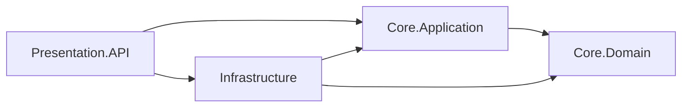

# Cattle Management Product and Technical Guide

## Product overview

The cattle management system helps people responsible for a cattle operation register animals, organize them into herds, and consult their current health status. Its HTTP API supports this workflow with consistent identifiers, registration validation, and a predictable error contract.

This guide describes the current release, the operational reasons for its capabilities, and the architectural principles behind the implementation. It connects Onion Architecture, dependency injection, domain modeling, and RFC 7807 to specific code and repeatable checks.

## Product proposition

**Operational question:** Which animals are registered, which herd does each belong to, and what is its current health status?

**Intended users:** People responsible for recording and checking a cattle operation's animal inventory and current health status.

**Available capabilities:** The API assigns every herd and animal a GUID, associates each animal with a herd, normalizes ear tags, rejects a duplicate tag regardless of letter case, and allows a health status change. Operators can identify a record consistently, retrieve its herd membership, and update the animal's current condition.

**Current release limits:** Records are held in a process-local in-memory store. Restarting the server clears them. The Blazor home page provides an API overview. Cattle entry forms, dashboards, authentication, reports, and durable storage are not implemented. The current release supports evaluation of the API workflow in a development environment; it does not provide durable operational recordkeeping.

### Cattle registration and health workflow

1. Create a herd with `POST /api/herds`.
2. Register an animal with `POST /api/animals`, using the herd's returned `id`.
3. Retrieve that animal with `GET /api/animals/{id}` to inspect its herd relationship and initial `healthStatus` value `0` (`Healthy`).
4. Send `PATCH /api/animals/{id}/health-status` with `{"status":1}` and retrieve the animal again to verify `UnderObservation`.
5. Repeat the registration with the same ear tag in different letter case to check that duplicate records are rejected with a controlled 400 response.
6. Request an unknown animal to check the controlled 404 response, then invoke the Development-only unexpected-error endpoint to inspect a safe 500 response.

The executable version of this sequence is the [Postman collection](../postman/Cattle-Management.postman_collection.json). Its `baseUrl` defaults to `http://localhost:18080`.

### HTTP API contract

| Method and route | Valid request or purpose | Success | Business failure raised by the application |
| --- | --- | --- | --- |
| `POST /api/herds` | `{"name":"North Pasture","description":"Breeding herd"}` | 201 with herd `id`, name, description, and UTC `createdAt`; `Location` identifies its GET route | Duplicate name or empty name → 400 |
| `GET /api/herds` | List registered herds | 200 with an array | None for an empty list |
| `GET /api/herds/{id}` | Retrieve one herd by GUID | 200 with one herd | Unknown GUID → 404 |
| `POST /api/animals` | `{"earTag":"C-001","breed":"Brahman","herdId":"<herd-guid>"}`; `dateOfBirth` is optional | 201 with normalized tag, herd information, initial numeric `healthStatus: 0`, and UTC `createdAt` | Unknown herd → 404; duplicate tag, missing required business text, or future birth date → 400 |
| `GET /api/animals` | List registered animals | 200 with an array | None for an empty list |
| `GET /api/animals/{id}` | Retrieve one animal by GUID | 200 with one animal | Unknown GUID → 404 |
| `PATCH /api/animals/{id}/health-status` | `{"status":1}`; `0` = healthy, `1` = under observation, `2` = in treatment | 200 with the updated animal | Unknown GUID → 404; undefined numeric status → 400 |
| `GET /api/demo/errors/{kind}` | Development-only `not-found`, `invalid-operation`, or `unexpected` | Deliberately raises a mapped exception | 404, 400, or safe 500, respectively |

`POST` returns 201 because a resource was created, `GET` reads resources, and `PATCH` changes only the health-status field. The table describes validly bound requests and business exceptions. Malformed JSON, invalid route shapes, and automatic MVC model-binding errors can follow framework behavior instead of the middleware's exception mapping.

## Onion Architecture and the dependency rule

The central idea of Onion Architecture is that business decisions should not depend on replaceable technical details such as HTTP, a database, or a UI framework. Source-code dependencies point inward. The outermost project may assemble the system, but inner projects cannot reference outer projects. This is the dependency inversion described by [Jeffrey Palermo](https://jeffreypalermo.com/2008/07/the-onion-architecture-part-1/).



The arrows show **compile-time project references**, not the order in which a request executes. The references are visible in the four `*.csproj` files and the [solution file](../DAW.slnx). `Core.Domain` has no project references or external NuGet dependencies. `Core.Application` references the domain and declares `ICattleRepository`. `Infrastructure` references the core projects and implements that interface. `Presentation.API` references application and infrastructure because `Program.cs` is the composition root that connects HTTP to the implementation.

At runtime, an HTTP request reaches a controller, which calls `ICattleCatalogService`. `CattleCatalogService` calls `ICattleRepository`; DI supplies `InMemoryCattleRepository`. The application depends on the repository **interface**, which describes the operations its cattle workflow needs. A future database adapter can implement that contract while the core model remains independent of the storage technology.

| Layer | Current responsibility | Code evidence | What it must not know |
| --- | --- | --- | --- |
| `Core.Domain` | Animal and herd state, identity, relationship, health status behavior | [`BaseEntity`](../src/Core.Domain/Common/BaseEntity.cs), [`Herd`](../src/Core.Domain/Cattle/Herd.cs), [`Animal`](../src/Core.Domain/Cattle/Animal.cs) | ASP.NET Core controllers or repository implementation |
| `Core.Application` | Use cases, result contracts, repository abstraction, registration validation | [`CattleCatalogService`](../src/Core.Application/Cattle/CattleCatalogService.cs), [`ICattleRepository`](../src/Core.Application/Cattle/ICattleRepository.cs) | Concrete storage or HTTP request objects |
| `Infrastructure` | Temporary in-memory repository and shared storage | [`InMemoryCattleRepository`](../src/Infrastructure/Cattle/InMemoryCattleRepository.cs) | Controller routing or response formatting |
| `Presentation.API` | HTTP routing, DI composition, centralized error conversion | [`Program.cs`](../src/Presentation.API/Program.cs), [controllers](../src/Presentation.API/Controllers/AnimalsController.cs), [`ExceptionMiddleware`](../src/Presentation.API/Middleware/ExceptionMiddleware.cs) | Ownership of core business rules |

### Domain relationship and invariants

`BaseEntity` creates a non-empty `Guid` and a UTC `CreatedAt` timestamp. `Herd` has a required name. `Animal` has a required ear tag and breed, holds a `Herd` reference, exposes its `HerdId`, and starts with `Healthy` status. Conceptually, one herd can contain many animals; each registered animal belongs to one herd. `Animal.ChangeHealthStatus` rejects undefined enum values.

The application service checks that the referenced herd exists, normalizes the ear tag to uppercase, and rejects duplicates through the repository. The registration validator rejects an empty breed and a future birth date. Entity validation protects the object when constructed, while application validation protects the registration use case before it looks up the herd. The current `Animal` constructor does not independently reject a future birth date; callers must use the application registration path to enforce that rule.

The in-memory repository checks duplicate herd names and ear tags with a scan of existing records. It does not provide a database unique index or an `O(1)` uniqueness guarantee. Those belong to a later persistence design.

## Dependency injection and object lifetimes

DI lets `Program.cs` choose concrete implementations without requiring controllers or use cases to instantiate them directly. ASP.NET Core's native container provides `Transient`, `Scoped`, and `Singleton` lifetimes. A scoped service is reused within one request scope; a transient service is created for each resolution; a singleton is shared for the process lifetime. See [Microsoft's service lifetime documentation](https://learn.microsoft.com/en-us/dotnet/core/extensions/dependency-injection/service-lifetimes).

| Registration in `Program.cs` | Lifetime | Purpose | Verification |
| --- | --- | --- | --- |
| `ICattleCatalogService` → `CattleCatalogService` | Scoped | One use-case service instance per request; it uses the request's repository. | Same instance within one scope; different across scopes. |
| `ICattleRepository` → `InMemoryCattleRepository` | Scoped | A request-specific repository adapter; future database work can replace its implementation. | Same instance within one scope; different across scopes. |
| `IAnimalRegistrationValidator` → `AnimalRegistrationValidator` | Transient | Stateless validation can be resolved independently. | Different instance on repeated resolutions. |
| `IAnimalTagNormalizer` → `AnimalTagNormalizer` | Singleton | Stateless and immutable utility behavior is safe to reuse. | Same instance across scopes. |
| `InMemoryCattleStore` | Singleton | Keeps registered cattle records visible across requests. | Same instance across scopes. |

A **captive dependency** occurs when a longer-lived object retains a shorter-lived object, such as a singleton constructor taking a scoped repository. The registrations here do not form that pattern: the scoped repository and service may depend on the singleton store and normalizer, but the singleton objects do not depend on scoped services. [`DependencyInjectionUsesExpectedLifetimes`](../tests/Core.Tests/ApiIntegrationTests.cs) resolves services in separate scopes and checks the expected identity behavior.

The store is a deliberate **mutable singleton exception** to the usual preference for immutable singleton utilities. It uses a lock around its dictionaries so independent requests share records and dictionary operations are synchronized. Its contents disappear on restart, and it does not offer transactional durability. A database-backed `DbContext` is not implemented; a future adapter should scope it to the request so a singleton cannot retain a context beyond its intended lifetime.

## Centralized HTTP errors and RFC 7807

Without a common boundary, each controller might catch and format exceptions differently. [`ExceptionMiddleware`](../src/Presentation.API/Middleware/ExceptionMiddleware.cs) is registered in `Program.cs` before controller endpoints, so exceptions raised later in the pipeline can be converted in one place. This is cross-cutting HTTP behavior and therefore belongs in the presentation layer, outside the domain.

| Exception | HTTP status | Response `title` | Example |
| --- | ---: | --- | --- |
| `KeyNotFoundException` | 404 | `Not Found` | An animal ID is unknown. |
| `InvalidOperationException` or `ArgumentException` | 400 | `Bad Request` | An ear tag already exists or input is invalid. |
| Other `Exception` | 500 | `Internal Server Error` | The Development-only demo throws an unexpected exception. |

The body uses the `application/problem+json` media type and the five [RFC 7807](https://www.rfc-editor.org/info/rfc7807/) members below:

| Member | Meaning in this implementation |
| --- | --- |
| `type` | `about:blank`, meaning the HTTP status itself identifies the generic problem type. |
| `title` | The standard reason phrase for the chosen status. |
| `status` | The numeric HTTP status code, matching the response status. |
| `detail` | A useful exception message for mapped 400/404; a generic message for 500. |
| `instance` | The request path where the failure occurred. |

For the unexpected-error demonstration, the response is equivalent to this example; the path is the actual request path:

```http
HTTP/1.1 500 Internal Server Error
Content-Type: application/problem+json

{"type":"about:blank","title":"Internal Server Error","status":500,"detail":"An unexpected error occurred.","instance":"/api/demo/errors/unexpected"}
```

The middleware logs unexpected exceptions on the server, clears an unstarted response, and returns a generic 500 detail. If headers have already been sent, it cannot safely replace that response and rethrows. The Development-only [`ErrorDemoController`](../src/Presentation.API/Controllers/ErrorDemoController.cs) deliberately raises exceptions for a repeatable demonstration; it returns 404 outside Development. The middleware covers **thrown exceptions**. It does not promise that every unrelated 400 or 404 generated by routing or model binding has this exact body.

## Verification strategy and evidence

The automated checks cover distinct boundaries:

| Level | What it proves | Where |
| --- | --- | --- |
| Domain and application unit tests | GUID/UTC identity, herd relationship, default and changed status, duplicate tag rejection, unknown herd, future birth date | [`DomainAndApplicationTests`](../tests/Core.Tests/DomainAndApplicationTests.cs) |
| Middleware unit tests | The middleware class maps thrown exceptions and hides unexpected details | [`ExceptionMiddlewareTests`](../tests/Core.Tests/ExceptionMiddlewareTests.cs) |
| HTTP integration tests | The real `Program.cs` host registers DI and middleware correctly; HTTP responses contain the required fields and media type | [`ApiIntegrationTests`](../tests/Core.Tests/ApiIntegrationTests.cs) |
| Postman/Newman | The published Docker image responds correctly across independent HTTP requests | [Cattle management API collection](../postman/Cattle-Management.postman_collection.json) |

Recorded implementation checks include 11 passing .NET tests, a successful Docker image build, and 7 passing Newman requests/assertions. The .NET suite exercises domain and application rules, isolated exception handling, and the HTTP host. The Postman collection exercises the application across independent requests. Repeat these checks when behavior changes; recorded results describe the revision tested.

On a computer with the .NET 10 SDK, use `dotnet build DAW.slnx` and `dotnet test DAW.slnx`. On Windows/Git Bash without a local SDK, use the Docker commands in the [README](../README.md#run-the-api). Run the application in Development to use the sample error endpoint, import the collection, and run its requests in order. Inspect the 500 response's status, media type, and JSON body to confirm the public error contract.

## Implementation and verification map

| Product or quality objective | Implementation | Verification |
| --- | --- | --- |
| Identify animals consistently and associate them with a herd | `BaseEntity`, `Herd`, and `Animal` | `EntitiesHaveGuidIdentityUtcCreationAndHerdRelationship` |
| Reject duplicate ear tags and invalid registrations | `AnimalTagNormalizer`, `AnimalRegistrationValidator`, and `CattleCatalogService` | Domain/application tests for duplicate tags, unknown herds, and future birth dates; Postman duplicate-tag request |
| Register, retrieve, and update cattle records across requests | Herd and animal controllers, catalog service, and shared in-memory store | `CattleEndpointsRetainHerdAndAnimalAcrossRequests`; Postman workflow |
| Keep business rules independent of storage and HTTP | Four projects, inward references, and `ICattleRepository` in Application | Project references and solution build |
| Resolve dependencies with suitable object lifetimes | Registrations in `Program.cs` | `DependencyInjectionUsesExpectedLifetimes` |
| Return predictable HTTP errors and hide internal failures | `ExceptionMiddleware` before controller endpoints | Middleware unit tests, `RegisteredPipelineReturnsProblemDetails`, and Postman error requests |

The map ties available behavior and quality objectives to implementation and repeatable checks. It does not include planned functionality.

## API walkthrough

1. **Register cattle.** In Postman, create a herd, register an animal, retrieve it, and change its health status. Inspect the returned GUID, UTC timestamp, normalized tag, herd ID, and status.
2. **Inspect the architecture.** Open the solution and project references. The domain has no ASP.NET Core or storage dependency; the application owns `ICattleRepository`; infrastructure implements it; the API composes the services.
3. **Inspect DI.** Open `Program.cs` and identify the scoped catalog service and repository, transient validator, singleton normalizer, and shared store. Use the lifetime test to check that singleton objects do not capture scoped services.
4. **Check error handling.** Run missing-animal 404, duplicate-tag 400, and unexpected 500 requests. Inspect `Content-Type` and the five Problem Details fields; confirm that 500 hides the simulated internal message.
5. **Run the automated checks.** Execute the .NET tests and the Postman collection. Evaluate the results alongside the release limits: records are in memory, the UI is an overview, and durable storage is not implemented.

The in-memory adapter allows the cattle workflow to run without database setup. It is singleton because separate HTTP requests must see the same records, and the scoped repository depends on that shared store. Durable operational use requires a persistence adapter and additional product capabilities beyond this release.

## Source references

- Jeffrey Palermo, [The Onion Architecture: Part 1](https://jeffreypalermo.com/2008/07/the-onion-architecture-part-1/).
- Microsoft Learn, [Service lifetimes](https://learn.microsoft.com/en-us/dotnet/core/extensions/dependency-injection/service-lifetimes).
- RFC Editor, [RFC 7807: Problem Details for HTTP APIs](https://www.rfc-editor.org/info/rfc7807/).
