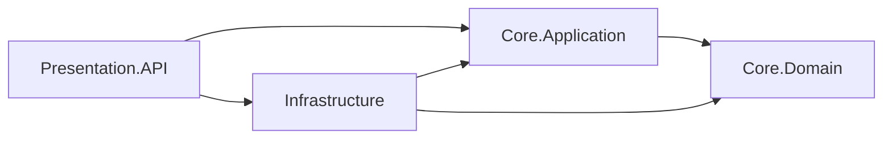

# Producto y fundamentos técnicos

## 1. Qué resuelve el sistema

La operación ganadera necesita identificar sus animales, conocer su ubicación y condición, registrar cuánto producen y controlar los insumos disponibles. La SPA React ofrece esos flujos mediante una API .NET persistente, con permisos de acceso por finca y operación.

**Disponibles:** ficha animal por pestañas, edición, fotos comprimidas y privadas, curva de peso/GDP, pesaje consecutivo, sanidad y retiro farmacológico, reproducción y genealogía, producción, potreros con detalle lateral/traslados, catálogo de insumos, movimientos de inventario, dashboard y reportes XLSX/PDF. La API conserva el CRUD de once recursos y agrega contratos operativos especializados. Swagger permite inspeccionarlos; la interfaz de uso diario es React.

El administrador con permisos de indicadores entra al dashboard. Employee y los usuarios sin acceso a ese resumen entran a Animales. Una ruta privada solicitada antes del login tiene prioridad y conserva su query/pestaña; esto también permite compartir enlaces a fichas. El dashboard financiero sigue protegido en la API.

## 2. Flujo operativo reproducible

### Uso de la SPA

1. Iniciar el entorno y la siembra según [setup](setup.md), abrir la raíz del sitio e iniciar sesión. El tema se puede alternar y la sesión se recupera al recargar.
2. Como Admin, revisar el dashboard por finca/período: leche registrada, bovinos con pesaje comparable, diagnósticos positivos/concluyentes y existencias críticas. El saldo de inventario representa el estado actual.
3. Entrar a Animales, buscar un arete y abrir su ficha; usar las pestañas para consultar sanidad, reproducción, producción, genealogía, ubicación, crecimiento y fotos.
4. Registrar pesos en la ficha o en Pesaje para captura consecutiva. La GDP compara fechas de pesajes; la pérdida de peso activa un aviso. El objetivo positivo manual todavía no es una política persistida.
5. Explorar un potrero en el panel lateral y registrar un traslado con destino y motivo. Capacidad y retiro sanitario se validan en el servidor.
6. Registrar movimientos de insumos y revisar su historial. Desde el KPI de leche, Consultar producción conserva el período/finca en el reporte; exportar XLSX/PDF desde Reportes.
7. Cerrar sesión. Como Employee, verificar las operaciones permitidas y la ausencia del dashboard administrativo.

### Comprobación de contratos por Swagger/HTTP

1. Ejecutar las migraciones y la siembra según [setup](setup.md).
2. Iniciar sesión en `POST /api/auth/login` con `username` —también acepta correo— y `password`.
3. Copiar `accessToken` y autorizar Swagger con el esquema Bearer. El resultado de login incluye vencimiento, refresh token y `user` con nombre, email, roles y permisos.
4. Consultar fincas y especies; sus respuestas incluyen `id` y `data` con los atributos editables. Los detalles de animales incluyen además sus UUID relacionados para poder editarlos.
5. Crear un animal con el UUID de su finca, especie y, opcionalmente, raza, lote y potrero:

```json
{
  "farmId": "<uuid-finca>",
  "speciesId": "<uuid-especie-bovina>",
  "internalTag": "BOV-009",
  "sex": "Female",
  "purpose": "DualPurpose",
  "birthDate": "2024-01-15"
}
```

6. Consultar `GET /api/animals/{id}`. El tag se normaliza en mayúsculas; un duplicado dentro de la misma finca devuelve 409. Una raza de otra especie o un lote de otra finca también se rechazan.
7. Actualizar su condición con `PATCH /api/animals/{id}/health-status`:

```json
{"status":"UnderObservation","reason":"Seguimiento de condición corporal"}
```

8. Registrar peso en `/api/weights` y producción en `/api/production`, proporcionando el animal, la finca y una fecha válida. Para ordeño: `productType: Milk`, `method: Milking`, `unit: Liter`. Para esquila: `Wool`, `Shearing`, `Kilogram`. Para carne: `Meat`, `Slaughter`, `Kilogram`.
9. Registrar varios productos del mismo sacrificio usando el mismo `operationId`: carne y piel ocupan filas distintas dentro de `AnimalProduction`. El animal queda `Dead` y no puede ser ordeñado posteriormente ni sacrificarse por segunda vez.
10. Crear categorías e insumos; registrar existencias en `/api/inventory`. El stock y sus umbrales pertenecen a la finca y al insumo, por lo que dos fincas pueden tener existencias diferentes del mismo SKU.

La [colección Postman](../postman/Cattle-Management.full.postman_collection.json) automatiza los flujos, las bajas en orden de dependencias y los escenarios 401, 403, 400, 404, 409 y 500.

## 3. Onion Architecture y Repository



Las flechas representan referencias entre proyectos. Domain contiene las entidades, sin referencias a EF o ASP.NET Core. Application define los contratos `ICrudService<TRequest>` y `IManagementRepository`, los validadores y las reglas de cada recurso. Infrastructure implementa el puerto de persistencia mediante EF. API compone esos servicios y convierte HTTP en llamadas al caso de uso.

La ejecución concreta sigue **controlador → CrudService → ResourceDefinition → IManagementRepository → ManagementRepository → AppDbContext → PostgreSQL**. La aplicación conoce la interfaz del repositorio, no el proveedor Npgsql ni `DbContext`. Los predicados LINQ se expresan como árboles `Expression<Func<T,bool>>`; EF traduce su ejecución a SQL desde Infrastructure. Los DTO evitan serializar navegaciones del dominio y crear ciclos JSON.

Los contratos de consulta existentes `IAnimalQueryService` e `IAnimalWeightReader` se conservan. Sus implementaciones proyectan los datos del animal y el último pesaje. Las lecturas usan `AsNoTracking`; las entidades sólo se rastrean cuando se necesita modificarlas. Véase la explicación original de [Onion Architecture](https://jeffreypalermo.com/2008/07/the-onion-architecture-part-1/) y [consultas sin seguimiento de EF Core](https://learn.microsoft.com/en-us/ef/core/querying/tracking).

## 4. DI y ciclos de vida

| Ciclo | Servicios | Motivo |
| --- | --- | --- |
| Scoped | `AppDbContext`, repositorios, CRUD, definiciones, consultas, permisos, autenticación y acceso a fincas | Comparten el contexto de una petición y su unidad de trabajo |
| Transient | `IValidator<TRequest>` | Cada resolución obtiene un validador independiente |
| Singleton | `ITokenService`, `IFileStorage`, validación inmutable de opciones JWT | Utilidades sin depender de un `DbContext` ni de servicios scoped |

`JwtOptionsValidator` verifica configuración; no es un validador de DTO de negocio. Las pruebas resuelven servicios desde dos ámbitos y verifican identidad/reutilización. No existe ya un almacén singleton de animales ni otra fuente de datos operativos en memoria. Documentación de [DI de Microsoft](https://learn.microsoft.com/en-us/dotnet/core/extensions/dependency-injection/service-lifetimes) y [registro de FluentValidation](https://docs.fluentvalidation.net/en/latest/di.html).

## 5. Integridad y transacciones

Fluent API declara UUID, tablas, longitudes, índices únicos, precisión monetaria `(18,2)`, valores predeterminados y restricciones. `Products.CategoryId` relaciona categorías e insumos con `Restrict`. `FarmInventory` tiene una fila única por finca/insumo. El email normalizado y el nombre de usuario normalizado tienen índices únicos para reforzar Identity.

El CRUD valida el DTO y las referencias antes de guardar. En PostgreSQL, la comprobación y escritura se ejecutan dentro de una transacción **Serializable**. Se guarda conjuntamente el rendimiento, el cambio de estado por sacrificio y los registros de auditoría. Un conflicto concurrente devuelve 409 y exige recargar/reintentar; no deja un animal muerto sin el rendimiento confirmado. Las violaciones reales de índices y claves foráneas también se convierten en 409, sin exponer SQL interno.

La auditoría implementada por `ManagementRepository` registra el usuario, entidad, acción, valores anteriores y nuevos. Cubre los casos de uso que pasan por ese repositorio; no se afirma que todas las operaciones de Identity, archivos o modificaciones SQL externas estén auditadas. La transformación de datos de una migración tampoco representa una acción de un usuario operativo.

## 6. Seguridad y errores HTTP

Identity conserva hashes de contraseñas; JWT HMAC-SHA256 protege la firma del token. El servidor valida firma, emisor, destinatario y expiración. Admin/Administrador mantiene catálogos y elimina registros. Employee opera sobre sus fincas y no puede ejecutar DELETE ni administrar categorías. SoloLectura consulta: un permiso de lectura nunca autoriza subir fotos ni asignar permisos.

Las fotos se sirven por un endpoint autenticado con `photos.get` y acceso a la finca. No se publica `/uploads` como carpeta estática. Los nombres internos se generan de forma segura y se verifica tamaño, tipo permitido y firma de formato. La validación de firma no equivale a un análisis completo de la imagen ni a un antivirus.

El pipeline utiliza `ExceptionMiddleware`, filtro de validación asíncrono y respuestas de estado de API. Se devuelve `application/problem+json` con `type`, `title`, `status`, `detail`, `instance`; los errores de FluentValidation añaden `errors` por campo. El mapeo de errores automáticos MVC se desactiva para evitar respuestas 401 sin `detail`. Los errores 500 mantienen un detalle genérico y se registran en el servidor. [RFC 7807](https://www.rfc-editor.org/rfc/rfc7807) establece el contrato de referencia; [FluentValidation](https://docs.fluentvalidation.net/en/latest/aspnet.html) documenta la validación asíncrona explícita.

## 7. Alcance y evidencia

Las pruebas .NET verifican reglas, API y autorización con EF InMemory; PostgreSQL se comprueba mediante migraciones reales, colección HTTP, SQL de restricciones y pruebas concurrentes. El registro de resultados y la comparación académica están en [Fase 2 y Fase 3](fases-2-y-3.md). No se identifica un modelo futuro mapeado con un módulo operativo terminado.

La [guía de negocio](guia-de-negocio.md) conserva la visión amplia, que también incluye módulos futuros como raciones, finanzas y tareas. Sanidad y reproducción ya tienen flujos operativos descritos en [Fase 4: cuidado animal](fase4-sanidad.md). Los once recursos y la producción se describen en [modelo y CRUD](modelo-produccion-y-crud.md). El [contraste con el ejemplo del profesor](fase4-referencia-profesor.md) y la [auditoría de entrega](fase4-auditoria.md) distinguen lo implementado de los pendientes.
